动态规划模板

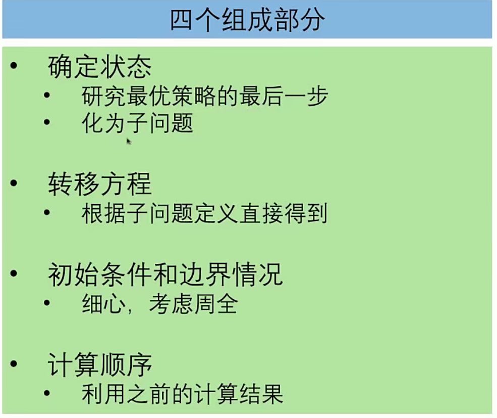

# 第一次课

## 什么是动态规划？

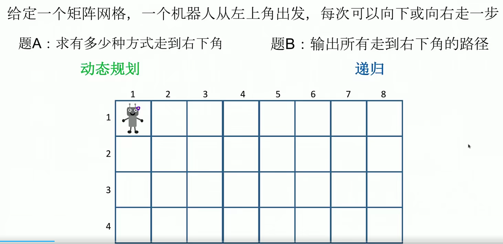

题A是动态规划，题B是递归

## 从题意分将动态规划分类

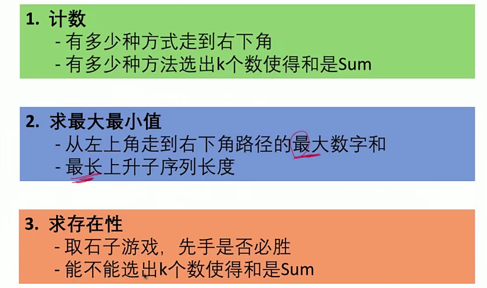

##  [322. 零钱兑换-最大最小类型](https://leetcode-cn.com/problems/coin-change/)

> 给出不同面额的硬币以及一个总金额. 写一个方法来计算给出的总金额可以换取的最少的硬币数量. 如果已有硬币的任意组合均无法与总金额面额相等, 那么返回 `-1`.
>
> ### Example
>
> **样例1**
>
> ```c++
> 输入：
> [1, 2, 5]
> 11
> 输出： 3
> 解释： 11 = 5 + 5 + 1
> ```

### 确定状态

* 最后一步

 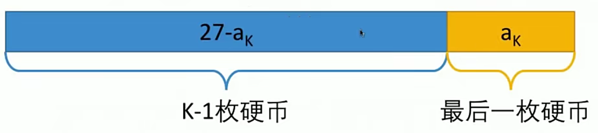

* 子问题

   * 最少**用多少枚硬币**可以拼出**27-ak**
   * 原问题：最少**用多少枚硬币**可以拼出**27**
  
* 定义状态

  我们定义状态f(x)=最少**用多少枚硬币**拼出**X**

### 转移方程 

 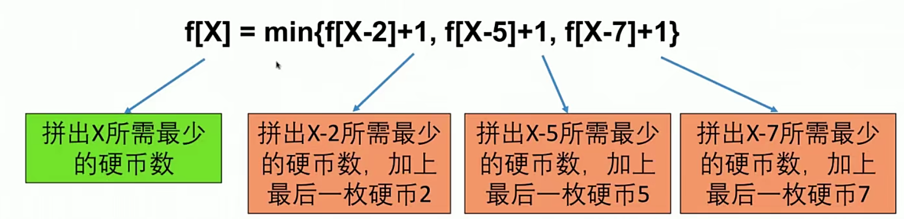

### 初始条件和边界情况

* f(x)=正无穷，其中x<0，正无穷表示拼不出来
* 初始条件：f(0)=0

###  计算顺序

初始条件f(0)---->f(1),f(2),.....f(27)

因为当计算f(x)时，f(x-2),f(x-5),f(x-7)都已经得到结果了

### 代码

```java
class Solution {
     public static int coinChange(int[] coins, int amount) {
        int[] dp=new int[amount+1];

        for(int i=1;i<=amount;i++){
            int min=Integer.MAX_VALUE;
            for(int j=0;j<coins.length;j++){
                int temp;
                if(i-coins[j]<0){
                    temp=Integer.MAX_VALUE;
                }else{
                    temp=dp[i-coins[j]];
                }
                if(temp<=min){
                    min=temp;
                }
            }
            if (min==Integer.MAX_VALUE){
                dp[i]=min;
            }else{
                dp[i]=min+1;
            }
        }

        return dp[amount]==Integer.MAX_VALUE?-1:dp[amount];
    }

}
```

  

## [62. 不同路径-计数型动态规划](https://leetcode-cn.com/problems/unique-paths/)

> 有一个机器人的位于一个 *m* × *n* 个网格左上角。
>
> 机器人每一时刻只能向下或者向右移动一步。机器人试图达到网格的右下角。
>
> 问有多少条不同的路径？

### 确定状态

* 最后一步

   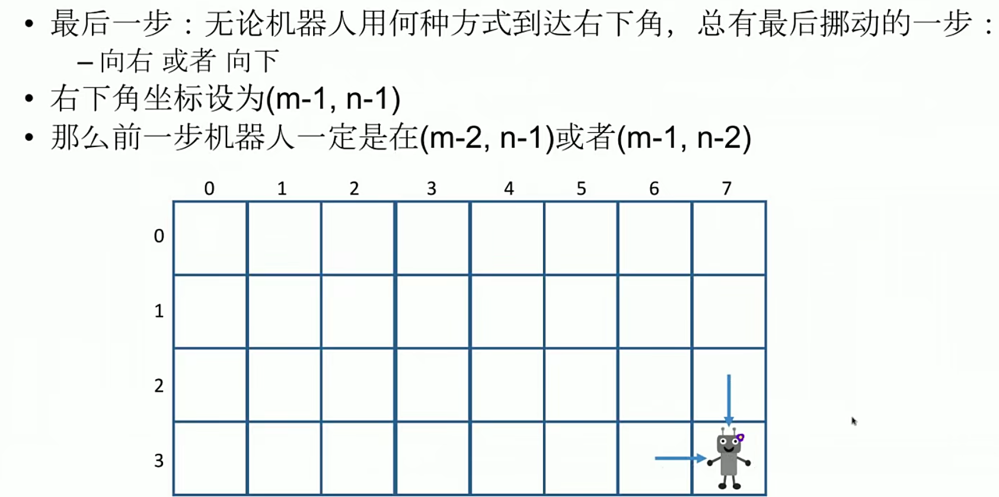

* 子问题

  两个子问题是可以直接加的，因为机器人只能右，下走，因此这两个位置互不相交。

   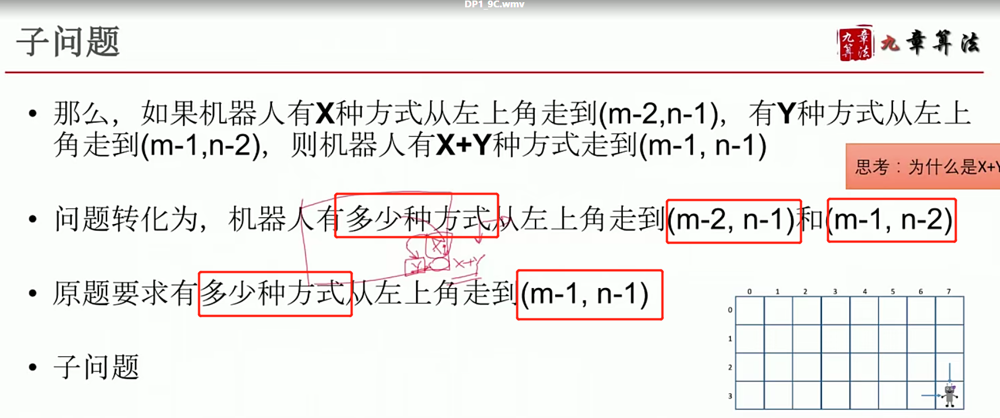

* 状态

  设f(i)(j)为机器人**有多少种方式**从左上角走到**(i,j)**

### 转移方程

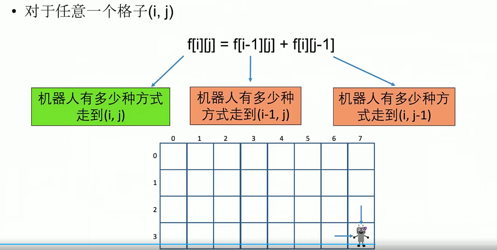

### 初始条件和边界情况

* 初始条件

  f(0)(0)=1 机器人只有一种方式走到左上角

* 边界情况

  i=0或j=0,则前一步只能有一种方式到左上角 f(i)(j)=1

### 计算顺序（先按行再按列）

用到的状态已经提前计算了出来

计算第0行-----不同列-------------------》

计算第1行-----不同列-------------------》

。。。

### 代码


```java
class Solution {
    public int uniquePaths(int m, int n) {
        int dp[][] =new int[m][n];
        
        for(int i=0;i<m;i++){
            for(int j=0;j<n;j++){
                if(i==0&&j==0){
                    dp[i][j]=1;
                }else if(i==0||j==0){
                    dp[i][j]=1;
                }else{
                    dp[i][j]=dp[i-1][j]+dp[i][j-1];
                }  
            }
        }

        return dp[m-1][n-1];
    }
}

```

## [55. 跳跃游戏--存在性动态规划](https://leetcode-cn.com/problems/jump-game/)

> 给出一个非负整数数组，你最初定位在数组的第一个位置。　　　
>
> 数组中的每个元素代表你在那个位置可以跳跃的最大长度。　　　　
>
> 判断你是否能到达数组的最后一个位置。
>
> ### Example
>
> ***样例 1***
>
> ```c++
> 输入 : [2,3,1,1,4]
> 输出 : true
> ```

### 确定状态

* 最后一步

  最后一步，青蛙从石头**i**跳到石头**n-1	(i<n-1)**

  * 青蛙能否跳到石头**i**
  * 最后一步不超过跳跃的最大距离 **n-1-i<=ai**

* 子问题

  * 青蛙**能否**跳到石头**i**
  * 原来我们求青蛙**能否**跳到石头**n-1**

* 状态 设f[j]表示**能否**跳到石头**j**

### 转移方程

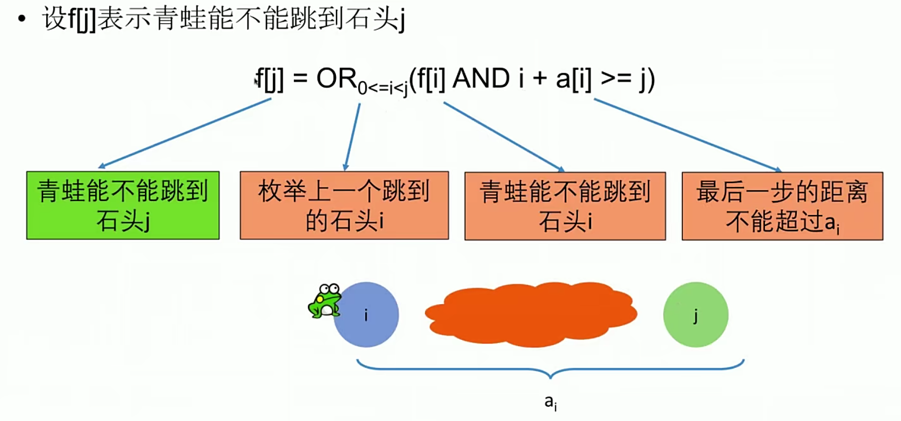

### 初始条件和边界情况

* 初始条件 f(0)=true; 因为青蛙一开始就在0位置

### 计算顺序

f(1),f(2)..........f(n-1)

### 代码

```java
class Solution {
    public boolean canJump(int[] nums) {
        boolean dp[] = new boolean[nums.length];
        dp[0]=true;
        for(int i=1;i<nums.length;i++){
            for(int j=0;j<i;j++){
                if(dp[j]==true&&nums[j]>=i-j){
                    dp[i]=true;
                    break;
                }
            }
        }
        return dp[nums.length-1];
    }
}
```


# 第二次课

## 动态规划从题型分类

- 坐标型动态规划

  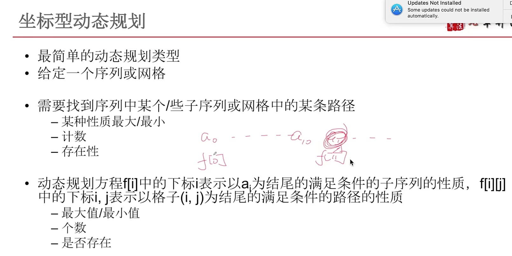

- 序列型动态规划

- 划分型动态规划

## 坐标型动态规划（到点(x,y)的f(x,y)值））

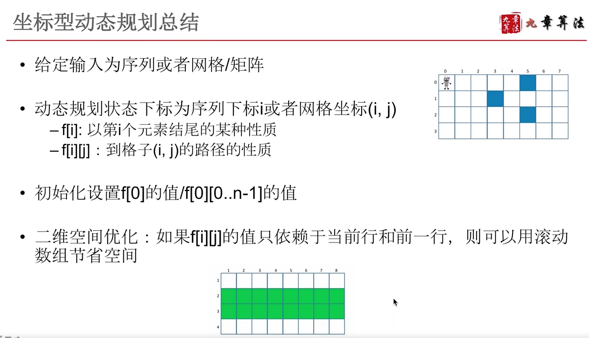

  ### [115. Unique Paths II](https://leetcode-cn.com/problems/unique-paths-ii/)

> 现在考虑网格中有障碍物，那样将会有多少条不同的路径？
>
> 网格中的障碍和空位置分别用 1 和 0 来表示。
>
> ####  确定状态

* 最后一步

   

* 子问题

  两个子问题是可以直接加的，因为机器人只能右，下走，因此这两个位置互不相交。

   

* 状态

  设f(i)(j)为机器人**有多少种方式**从左上角走到**(i,j)**

#### 转移方程


#### 初始条件和边界情况

* 初始条件

  f(0)(0)=1 机器人只有一种方式走到左上角

* 边界情况

  i=0或j=0,则前一步只能有一种方式到左上角 f(i)(j)=1
  
* **如果(i,j)格有障碍，f(i)(j)=0,表示机器人不能到达此格（0种方式）**

#### 计算顺序（先按行再按列）

用到的状态已经提前计算了出来

计算第0行-----不同列-------------------》

计算第1行-----不同列-------------------》

。。。

#### 代码


```java
 public int uniquePathsWithObstacles(int[][] obstacleGrid) {
        //m行，n列
        int m=obstacleGrid.length;
        int n=obstacleGrid[0].length;
        
        int dp[][] = new int[m][n];
        dp[0][0]=1;

        for(int i=0;i<m;i++){
            for(int j=0;j<n;j++){
                if(obstacleGrid[i][j]==1){
                    dp[i][j]=0;
                }else{
                     if(i==0&&j==0){
                    dp[i][j]=1;
                    continue;
                    }
               if(i==0){
                    dp[i][j]=dp[i][j-1];
                    continue;
                }
                if(j==0){
                    dp[i][j]=dp[i-1][j];
                    continue;
                }
                dp[i][j]=dp[i][j-1]+dp[i-1][j];
                }
               
            }

        }

        return dp[m-1][n-1];
    }
```

### [ 397. 最长上升连续子序列](https://www.lintcode.com/problem/397/)

> 给定一个整数数组（下标从 0 到 n-1， n 表示整个数组的规模），请找出该数组中的最长上升连续子序列。（最长上升连续子序列可以定义为从右到左或从左到右的序列。）
>
> ### 样例
>
> **Example 1:**
>
> ```
> Input: [5, 4, 2, 1, 3]
> Output: 4
> Explanation:
> For [5, 4, 2, 1, 3], the LICS  is [5, 4, 2, 1], return 4.
> ```
>
> **Example 2:**
>
> ```
> Input: [5, 1, 2, 3, 4]
> Output: 4
> Explanation:
> For [5, 1, 2, 3, 4], the LICS  is [1, 2, 3, 4], return 4.
> ```
#### 确定状态

* 最后一步

   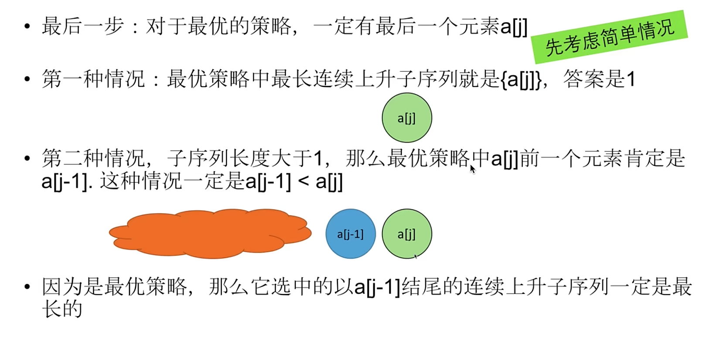

* 子问题

  

   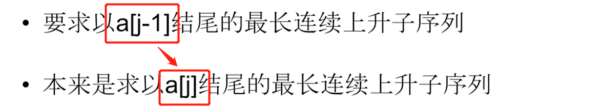

* 状态

  设f(j）=以a[j]结尾的最长连续上升子序列的长度

#### 转移方程

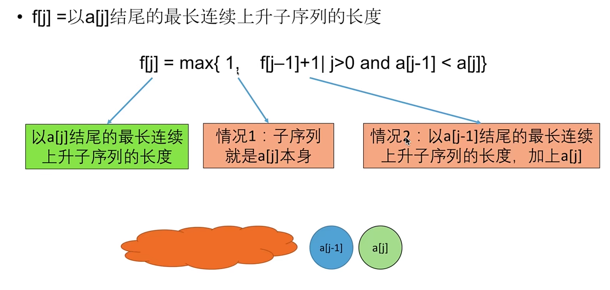

#### 初始条件和边界情况

* 初始条件

  f(0)=1 第一个元素长度为1

* 边界情况

  j>0,a[j]前面至少还有一个元素

#### 计算顺序（按行顺序计算）

用到的状态已经提前计算了出来

f(0),f(1),f(2),f(3)........f(n-1)

* 答案是Max(f(0),f(1),f(2),f(3)........f(n-1))

#### 代码


```java
public class Solution {
    /**
     * @param A: An array of Integer
     * @return: an integer
     */
    public int longestIncreasingContinuousSubsequence(int[] A) {
        if(A.length==0||A.length==1)
        return A.length;
        // write your code here
        int[] dp=new int[A.length];
        dp[0]=1;
        int max1=0;
        int max2=0;
        for (int i=1; i<A.length;i++ ){
            if(A[i]>A[i-1]){
                dp[i]=dp[i-1]+1;
            }else{
                dp[i]=1;
            }
            if(dp[i]>=max1){
                max1=dp[i];
            }
        }
     
        
         for (int i=1; i<A.length;i++ ){
            if(A[i]<A[i-1]){
                dp[i]=dp[i-1]+1;
            }else{
                dp[i]=1;
            }
            if(dp[i]>=max2){
                max2=dp[i];
            }
            System.out.println(dp[i]);
        }
        
        
        return Math.max(max1,max2);
    }
}
```

### [64. 最小路径和](https://leetcode-cn.com/problems/minimum-path-sum/)

>给定一个包含非负整数的 m x n 网格 grid ，请找出一条从左上角到右下角的路径，使得路径上的
>数字总和为最小。
>说明：每次只能向下或者向右移动一步。
#### 确定状态

* 最后一步

   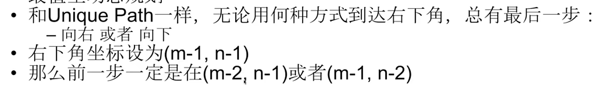

* 子问题

  

   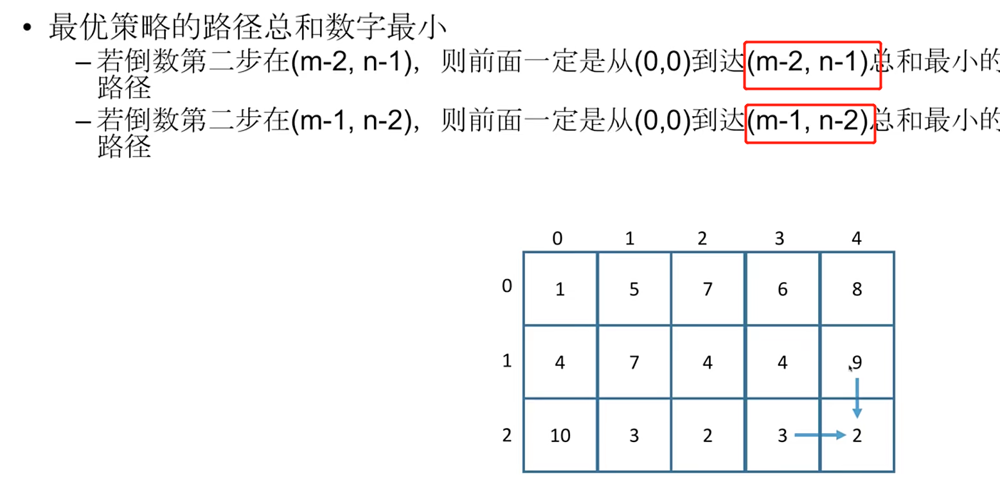

* 状态

  设f(i,j）=从（0，0）走到（i，j）的最小数字总和

#### 转移方程

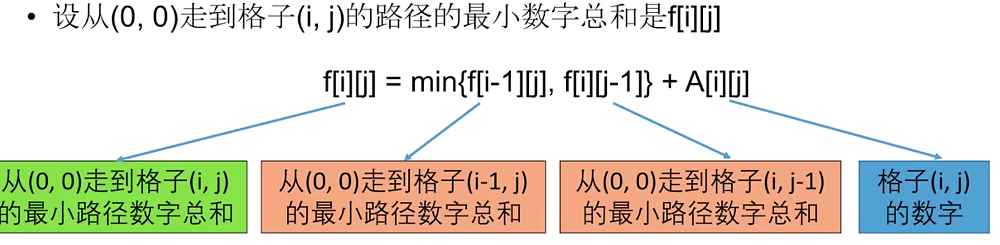

#### 初始条件和边界情况

* 初始条件

  f(0，0)=A(0,0) 

* 边界情况

  i=0,j=0,则前一步只能由一个方向过来

#### 计算顺序（先按行顺序计算，再按列计算）

用到的状态已经提前计算了出来

f(0,0),f(0,1),f(0,2),f(0,3)........f(0,n-1)

f(1,0),f(1,1),f(1,2),f(1,3)........f(1,n-1)

......

f(m-1,0),f(m-1,1),f(m-1,2),f(m-1,3)........f(m-1,n-1)

#### 代码


```java
class Solution {
    public int minPathSum(int[][] grid) {
        if(grid.length==0||grid[0].length==0){
            return 0;
        }
        int[][] dp= new int[grid.length][grid[0].length];
        
        for(int i=0;i<grid.length;i++){
            for(int j=0;j<grid[0].length;j++){
                if(i==0&&j==0){
                   dp[0][0]=grid[0][0];
                }else if(i==0){
                   dp[i][j]=dp[0][j-1]+grid[i][j];
                }else if(j==0){
                   dp[i][j]=dp[i-1][0]+grid[i][j];
                }else{
                   dp[i][j]=Math.min(dp[i-1][j],dp[i][j-1])+grid[i][j];
                }
            }
        }
    
        return dp[grid.length-1][grid[0].length-1];
    }
}
```
#### 空间优化

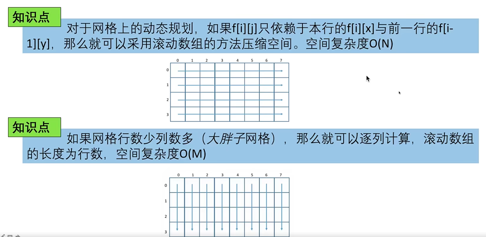

```java
class Solution {
    public int minPathSum(int[][] grid) {
        if(grid.length==0||grid[0].length==0){
            return 0;
        }
        int m=grid.length;
        int n=grid[0].length;
        //空间优化 只用两行 当前行now 和上一行old
        int[][] dp= new int[2][n];
        int now=0,old=1;
        for(int i=0;i<m;i++){
           
            for(int j=0;j<n;j++){
                if(i==0&&j==0){
                   dp[0][0]=grid[0][0];
                }else if(i==0){
                   dp[now][j]=dp[now][j-1]+grid[i][j];
                }else if(j==0){
                   dp[now][j]=dp[old][0]+grid[i][j];
                }else{
                   dp[now][j]=Math.min(dp[old][j],dp[now][j-1])+grid[i][j];
                }
            }
            old = now; // old is row i-1
            now=1-now; //now is row i
            //rolling array
    
        }
        //已经反转刚才的now-->old
        return dp[old][n-1];
    }
}
```


### [361. 轰炸敌人](https://leetcode-cn.com/problems/bomb-enemy/)

>由于炸弹的威力不足以穿透墙体，炸弹只能炸到同一行和同一列没被墙体挡住的敌人。
>
>**注意：**你只能把炸弹放在一个空的格子里
#### 确定状态

* 最后一步

   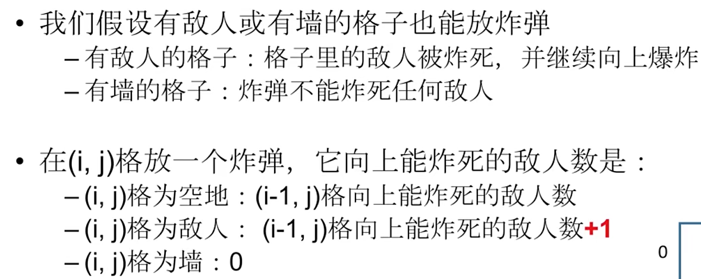

* 子问题

  

   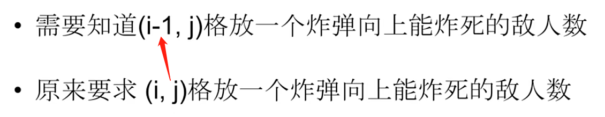

* 状态

  设up(i,j）=在（i，j）放一个炸弹向上炸死的敌人数。

#### 转移方程

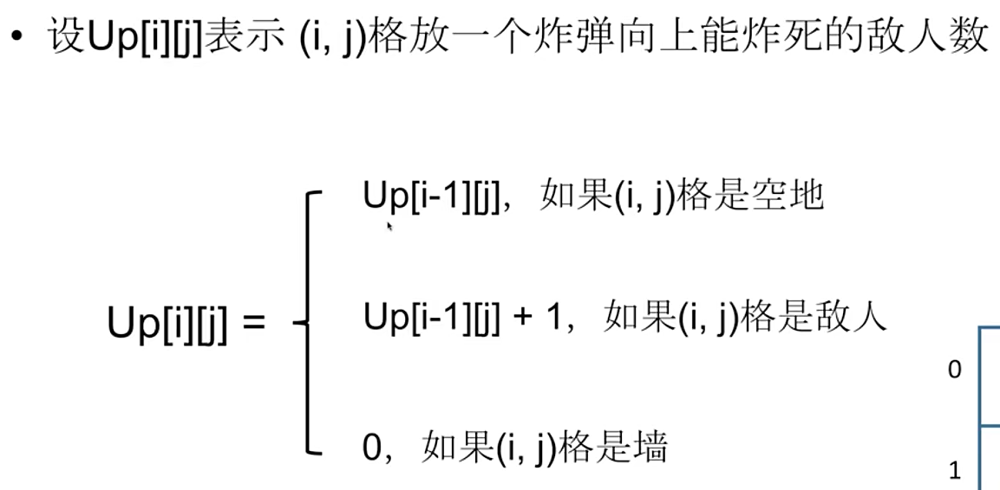

#### 初始条件和边界情况

* 初始条件

  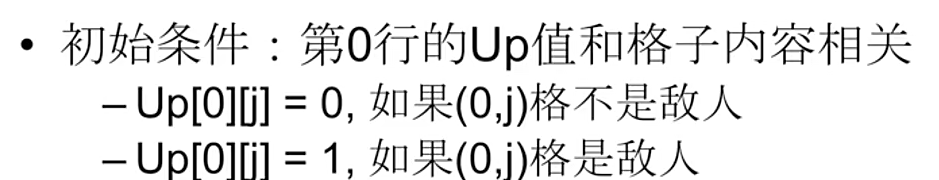


#### 计算顺序（先按行顺序计算，再按列计算）

用到的状态已经提前计算了出来

up(0,0),up(0,1),up(0,2),up(0,3)........up(0,n-1)

up(1,0),up(1,1),up(1,2),up(1,3)........up(1,n-1)

......

up(m-1,0),up(m-1,1),up(m-1,2),up(m-1,3)........up(m-1,n-1)

#### 四个方向

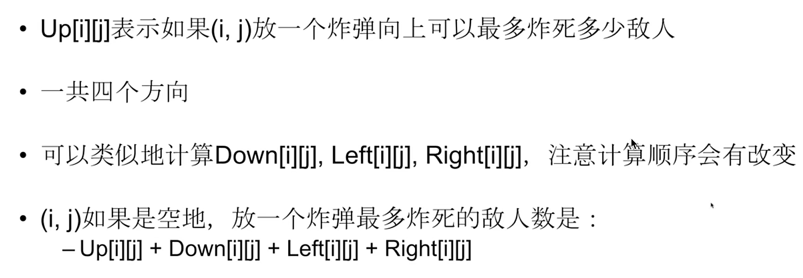

#### 代码


```java
class Solution {
    public int maxKilledEnemies(char[][] grid) {

        if(grid.length==0||grid[0].length==0)
            return 0;
        int m=grid.length;
        int n=grid[0].length;    
        int[][] up= new int[m][n];
        for(int i=0;i<m;i++){
            for(int j=0;j<n;j++){
                if(i==0&&j==0){
                   if(grid[0][0]=='E'){
                       up[0][0]=1;
                   }else{
                       up[0][0]=0;
                   } 
                }else if(i==0){
                   if(grid[0][j]=='E'){
                       up[0][j]=1;
                   }else{
                       up[0][j]=0;
                   } 
                }else{
                    if(grid[i][j]=='E'){
                       up[i][j]=up[i-1][j]+1;
                   }else if(grid[i][j]=='W'){
                       up[i][j]=0;
                   }else{
                       up[i][j]=up[i-1][j];
                   } 
                }
            }
        } 

        int[][] down= new int[m][n];
        for(int i=m-1;i>=0;i--){
            for(int j=0;j<n;j++){
                if(i==m-1&&j==0){
                   if(grid[i][j]=='E'){
                       down[i][j]=1;
                   }else{
                       down[i][j]=0;
                   } 
                }else if(i==m-1){
                   if(grid[i][j]=='E'){
                       down[i][j]=1;
                   }else{
                       down[i][j]=0;
                   } 
                }else{
                    if(grid[i][j]=='E'){
                       down[i][j]=down[i+1][j]+1;
                   }else if(grid[i][j]=='W'){
                       down[i][j]=0;
                   }else{
                       down[i][j]=down[i+1][j];
                   } 
                }
            }
        }

        int[][] right= new int[m][n];
         for(int i=0;i<m;i++){
            for(int j=n-1;j>=0;j--){
                if(i==0&&j==n-1){
                   if(grid[i][j]=='E'){
                       right[i][j]=1;
                   }else{
                       right[i][j]=0;
                   } 
                }else if(j==n-1){
                   if(grid[i][j]=='E'){
                       right[i][j]=1;
                   }else{
                       right[i][j]=0;
                   } 
                }else{
                   if(grid[i][j]=='E'){
                       right[i][j]=right[i][j+1]+1;
                   }else if(grid[i][j]=='W'){
                       right[i][j]=0;
                   }else{
                       right[i][j]=right[i][j+1];
                   } 
                }
            }
        } 

        int[][] left= new int[m][n];
         for(int i=0;i<m;i++){
            for(int j=0;j<n;j++){
                if(i==0&&j==0){
                   if(grid[i][j]=='E'){
                       left[i][j]=1;
                   }else{
                       left[i][j]=0;
                   } 
                }else if(j==0){
                   if(grid[i][j]=='E'){
                       left[i][j]=1;
                   }else{
                       left[i][j]=0;
                   } 
                }else{
                   if(grid[i][j]=='E'){
                       left[i][j]=left[i][j-1]+1;
                   }else if(grid[i][j]=='W'){
                       left[i][j]=0;
                   }else{
                       left[i][j]=left[i][j-1];
                   } 
                }
            }
        }

        int max=0; 
        for(int i=0;i<m;i++){
            for(int j=0;j<n;j++){
                   if(grid[i][j]=='0'){
                       if(up[i][j]+down[i][j]+right[i][j]+left[i][j]>=max){
                           max=up[i][j]+down[i][j]+right[i][j]+left[i][j];
                       }
                   } 
            }
        }

        return max;
    }
}
```


## 序列型动态规划（序列前x项的f(x)值）

### [256. 粉刷房子](https://leetcode-cn.com/problems/paint-house/)

#### 确定状态

* 最后一步

   已知最后一步的颜色往前求前一步最小花费时，不知道前一步的颜色，求出来前一步的最小花费可能发生颜色的碰撞,所以前一步的最小花费需要记录颜色**（序列+状态）**

    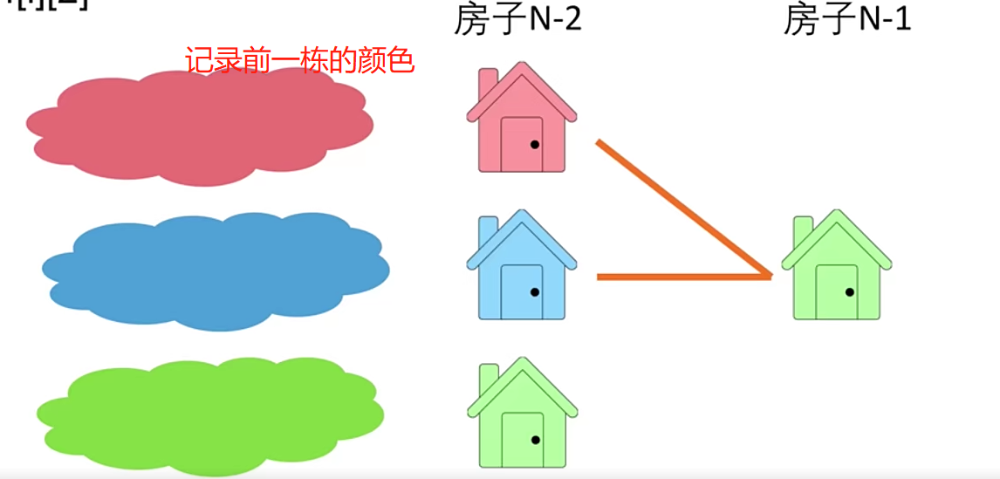

* 子问题

   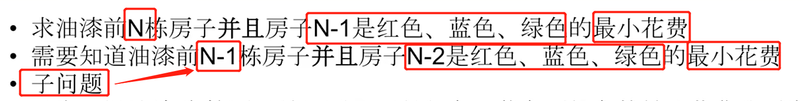

* 状态

  设f(i)(j)为油漆前**i**栋(0至i-1)，并且第**i-1**栋是**j种颜色**的**最小花费**

#### 转移方程

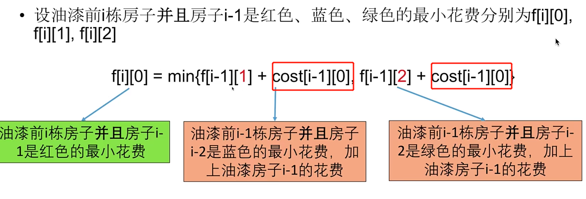


#### 初始条件和边界情况

* **序列初始化十分方便 前0项就是没有项直接等于0**

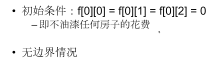

#### 计算顺序（先按行再按列）

用到的状态已经提前计算了出来

计算第0行-----不同列-------------------》f(0)(0) f(0)(1) f(0)(2)

计算第1行-----不同列-------------------》f(1)(0) f(1)(1) f(1)(2)

。。。

计算第N行-----不同列-------------------》f(N)(0) f(N)(1) f(N)(2)

答案是min(f(N)(0) ,f(N)(1) ,f(N)(2))

#### 代码

```java
class Solution {
   public static int minCost(int[][] costs) {
        if(costs.length==0||costs[0].length==0)
            return 0;
        int m=costs.length+1;
        int n=costs[0].length;
        
        //初始状态不用设 默认前0项为0
        //前n个房子第j个颜色 包括0种颜色的最小花销
        int dp[][]= new int[m][n];
        for(int i=1;i<m;i++){
            for(int j=0;j<n;j++){
                //前i个第j种颜色的最小花费
                int min=Integer.MAX_VALUE;
                for(int k=0;k<n;k++){
                    if(k==j){
                        continue;
                    }
                    if(dp[i-1][k]<=min){
                        min=dp[i-1][k];
                    }
                }
                dp[i][j]=min+costs[i-1][j];
            }
        }
        int result=Integer.MAX_VALUE;
        for(int k=0;k<n;k++){
            if(dp[m-1][k]<=result){
                result=dp[m-1][k];
            }
        }
        return result;
    }
}
```

### [序列+位操作型动态规划](https://leetcode-cn.com/problems/counting-bits/)

>[338. 比特位计数](https://leetcode-cn.com/problems/counting-bits/)

给定一个非负整数 **num**。对于 **0 ≤ i ≤ num** 范围中的每个数字 **i** ，计算其二进制数中的 1 的数目并将它们作为数组返回。

**示例 1:**

```
输入: 2
输出: [0,1,1]
```

**示例 2:**

```
输入: 5
输出: [0,1,1,2,1,2]
```

#### 确定状态

* 最后一步

    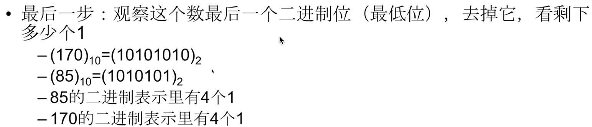

* 子问题

   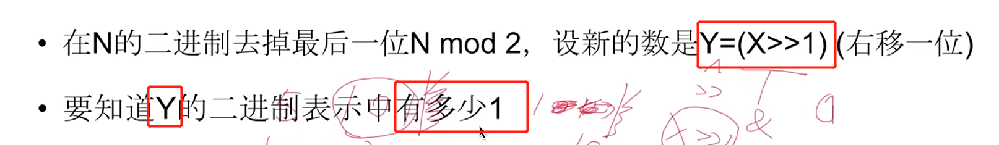

* 状态

  设f(i)表示i的二进制有多少个1**（和位操作相关的动态规划一般用值作状态）**

#### 转移方程

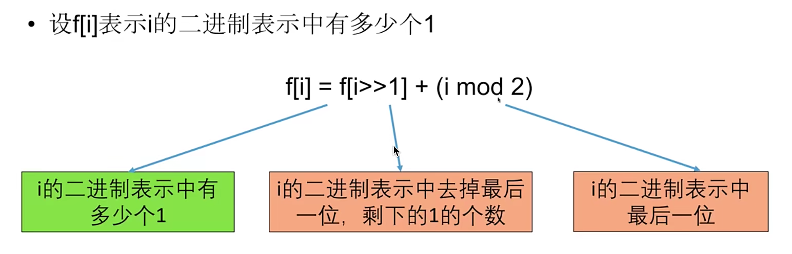


#### 初始条件和边界情况

* **f(0)=0**

#### 计算顺序（按行从小到大）

用到的状态已经提前计算了出来

f(0)，f(1) ,f(2),....f(n)

#### 代码

```java
class Solution {
    public int[] countBits(int num) {
        int[] dp=new int[num+1];

        for(int i=1;i<=num;i++){
            dp[i]=dp[i>>1]+i%2;
        }

        return dp;
    }
}
```


## 划分型动态规划(划分序列前i个值为f(i))

[91. 解码方法](https://leetcode-cn.com/problems/decode-ways/)

> 有一个消息包含`A-Z`通过以下规则编码
>
> ```c++
> 'A' -> 1
> 'B' -> 2
> ...
> 'Z' -> 26
> ```
>
> 现在给你一个加密过后的消息，问有几种解码的方式
>
> ### Example
>
> **样例 1:**
>
> ```c++
> 输入: "12"
> 输出: 2
> 解释: 它可以被解码为 AB (1 2) 或 L (12).
> ```
### 确定状态

* 最后一步

   解密数字串即**划分**若干段数字，每段数字对应一个字母。

   最后一步，对应一个字母（可能划分两个数字，可能划分一个数字）

* 子问题

   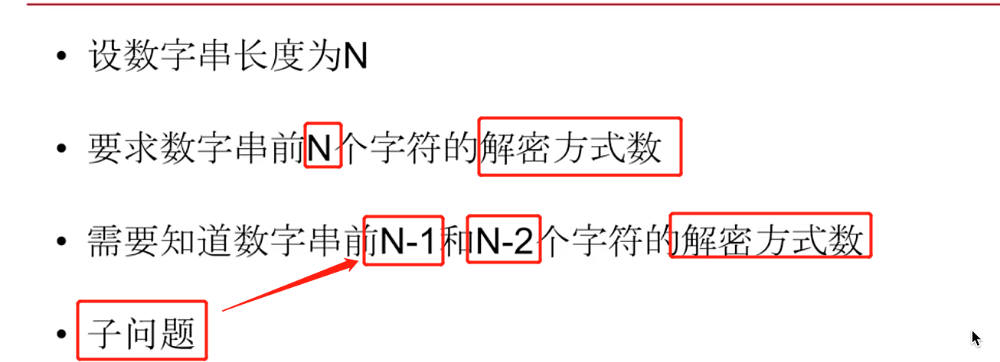

* 状态

  设**f(i)**为数字串S**前i个字符**的**解密方式数**

### 转移方程

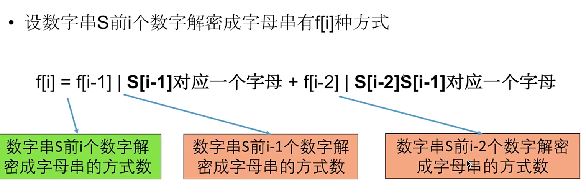

### 初始条件和边界情况

* **序列初始化十分方便 前0项就是没有项直接解密为空字符串=1**

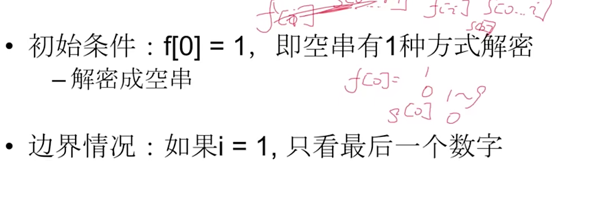

### 计算顺序

用到的状态已经提前计算了出来

f(0),f(1),f(2)....f(n)

### 代码

```java
class Solution {
    public int numDecodings(String s) {
        char[] chars=s.toCharArray();
        int length=chars.length;
        int[] dp=new int[length+1];
        dp[0]=1;
        for(int i=1;i<=length;i++){
            if(i-1>=0){
              if('1'<=chars[i-1]&&chars[i-1]<='9'){
                dp[i]+=dp[i-1];
               }  
            }else{
                continue;
            }

            if(i-2>=0){
                if('0'<=chars[i-1]&&chars[i-1]<='6'&&chars[i-2]=='2'||'1'==chars[i-2]&&'0'<=chars[i-1]&&chars[i-1]<='9'){
                dp[i]+=dp[i-2];
                }
            }else{
                continue;
            }
           
        }
        return dp[length];
    }
}
```

# 第三次课

## 序列型动态规划

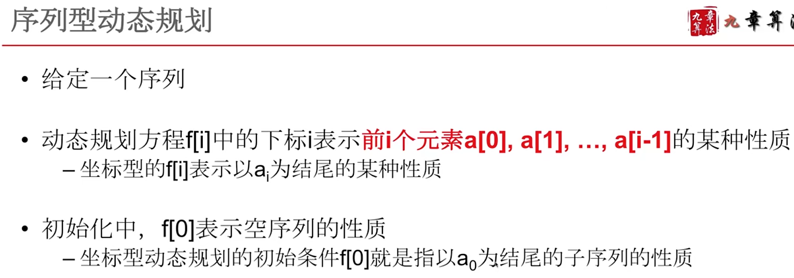

### [265. 粉刷房子 II](https://leetcode-cn.com/problems/paint-house-ii/)

#### 确定状态

* 最后一步

   已知最后一步的颜色往前求前一步最小花费时，不知道前一步的颜色，求出来前一步的最小花费可能发生颜色的碰撞,所以前一步的最小花费需要记录颜色**（序列+状态）**

    

* 子问题

   

* 状态

  设f(i)(j)为油漆前**i**栋(0至i-1)，并且第**i-1**栋是**j种颜色**的**最小花费**

#### 转移方程

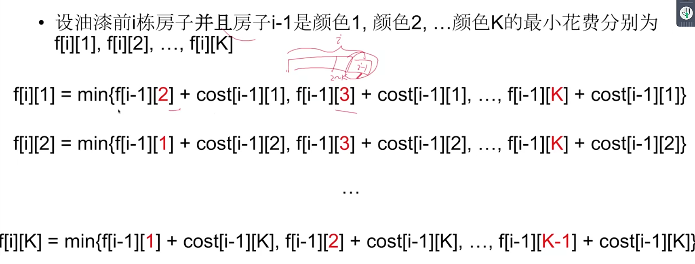

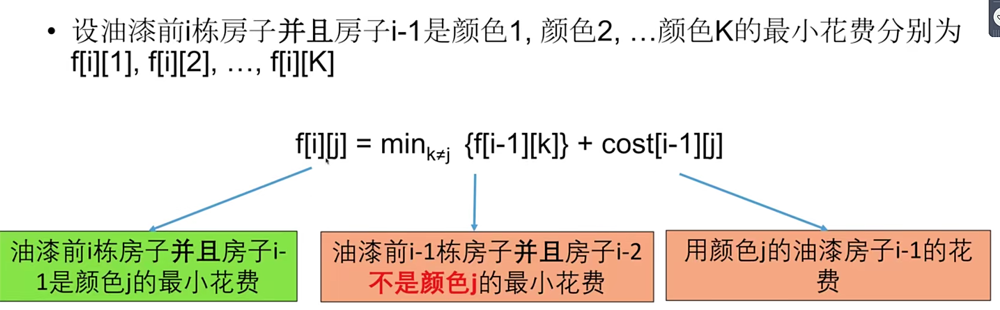

#### 动态规划优化时间复杂度

##### 之前的时间复杂度

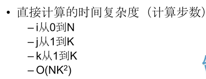

##### 优化问题 

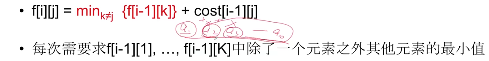

##### 解决方法

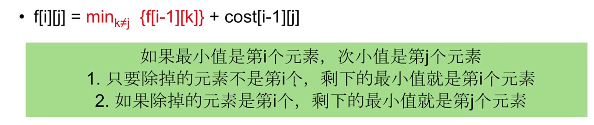

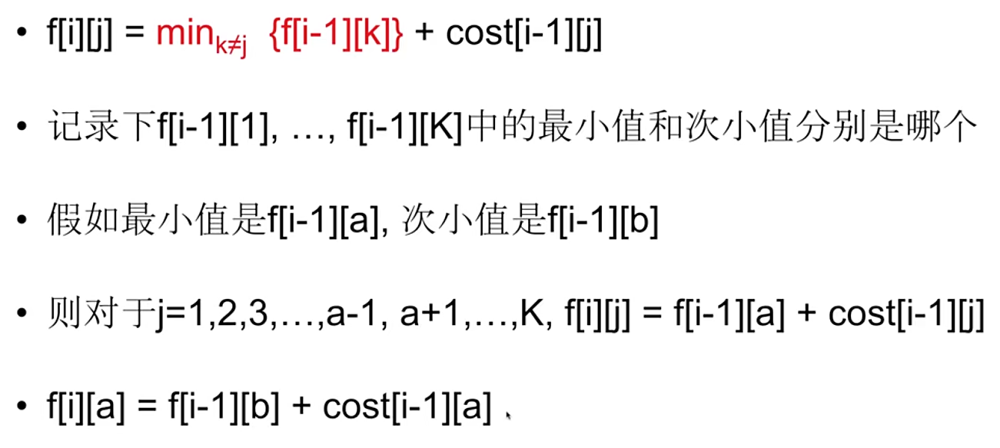

#### 初始条件和边界情况

* **序列初始化十分方便 前0项就是没有项直接等于0**


#### 计算顺序（先按行再按列）

用到的状态已经提前计算了出来

计算第0行-----不同列-------------------》f(0)(0) f(0)(1) f(0)(k-1)

计算第1行-----不同列-------------------》f(1)(0) f(1)(1) f(1)(k-1)

。。。

计算第N行-----不同列-------------------》f(N)(0) f(N)(1) f(N)(k-1)

答案是min(f(N)(0) ,f(N)(1) ,f(N)(2))

#### 代码

```java
class Solution {
 public static int minCostII(int[][] costs) {
        if (costs.length == 0 || costs[0].length == 0)
            return 0;
        
        int m = costs.length + 1;
        int n = costs[0].length;
        
        if (n==1){
            if (m==2){
                return costs[0][0];
            }else{
                return Integer.MAX_VALUE;
            }
        }
        //初始状态不用设 默认前0项为0
        //前n个房子第j个颜色 包括0种颜色的最小花销
        int dp[][] = new int[m][n];
        for (int i = 1; i < m; i++) {
            //前i-1个的最小花费和次小花费\
            int min = Integer.MAX_VALUE;
            int minindex = 0;
            int secondmin = Integer.MAX_VALUE;
            int secondminindex = 0;

            for (int k = 0; k < n; k++) {
                if (dp[i - 1][k] <= min) {
                    secondmin = min;
                    secondminindex = minindex;
                    min = dp[i - 1][k];
                    minindex = k;
                }
                if (dp[i - 1][k] > min && dp[i - 1][k] <= secondmin) {
                    secondmin = dp[i - 1][k];
                    secondminindex = k;
                }
            }


            for (int j = 0; j < n; j++) {
                if (j == minindex) {
                    dp[i][j] = secondmin + costs[i - 1][j];
                } else {
                    dp[i][j] = min + costs[i - 1][j];
                }
            }
        }
        int result = Integer.MAX_VALUE;
        for (int k = 0; k < n; k++) {
            if (dp[m - 1][k] <= result) {
                result = dp[m - 1][k];
            }
        }
        return result;
    }
}
```

[392. House Robber](https://www.lintcode.com/problem/house-robber/description)

- DP解法

  ```c++
  class Solution 
  {
  public:
      /**
       * @param A: An array of non-negative integers
       * @return: The maximum amount of money you can rob tonight
       */
      long long houseRobber(vector<int> &A) 
      {
          // write your code here
          if(A.empty())
          {
              return 0;
          }
          if(A.size() <= 3)
          {
              if(A.size() == 1)
              {
                  return A[0];
              }
              
              if(A.size() == 2)
              {
                  return std::max(A[0],A[1]);
              }
              
              if(A.size() == 3)
              {
                  return std::max(A[1],A[0] + A[2]);
              }
          }
          int len = A.size();
          vector<long long> dp(len);
          dp[len - 1] = A[len - 1];
          dp[len - 2] = A[len - 2];
          dp[len - 3] = dp[len - 1] + A[len - 3];
          
          long long maxnum = 0;
          
          for(int i = len - 4;i >= 0;i--)
          {
              dp[i] = A[i] + std::max(dp[i + 2],dp[i + 3]);
          }
          
          //return *max_element(dp.begin(),dp.end());
          return std::max(dp[0],dp[1]);
      }
  };
  ```

  这个题目和[面试题 17.16. 按摩师](https://leetcode-cn.com/problems/the-masseuse-lcci/)是同样的题目。吐槽一下，我写的程序是真的渣啊。🤷
  
  这个题目的额外空间复杂度可以优化到`O(1)`。
  
- DP解法二 参考老师的程序

  ```c++
  class Solution 
  {
  public:
      /**
       * @param A: An array of non-negative integers
       * @return: The maximum amount of money you can rob tonight
       */
      long long houseRobber(vector<int> &A) 
      {
          int len = A.size();
          
          vector<long long> dp(len);
          
          dp[0] = A[0];
          dp[1] = A[1];
          
          for(int i = 2;i < len;i++)
          {
              dp[i] = std::max(dp[i - 1],dp[i - 2] + A[i]);
          }
          
          return dp[len - 1];
      }
  };
  ```

- DP解法 将额外空间复杂度优化到`O(1)`👍

  ```c++
    class Solution 
    {
    public:
        /**
         * @param A: An array of non-negative integers
         * @return: The maximum amount of money you can rob tonight
         */
        long long houseRobber(vector<int> &A) 
        {
            if(A.empty())
            {
                return 0;
            }
            
            if(A.size() == 1)
            {
                return A[0];
            }
            int len = A.size();
            
            //vector<long long> dp(len);
            
            //dp[0] = A[0];
            //dp[1] = A[1];
            long long dp0 = A[0];  //i - 2
            long long dp1 = max(A[0],A[1]);
            
            for(int i = 2;i < len;i++)
            {
                //dp[i] = std::max(dp[i - 1],dp[i - 2] + A[i]);
                long long num = std::max(dp1,dp0 + A[i]);
                dp0 = dp1;
                dp1 = num;
            }
            
            return dp1;
        }
    };
  ```

    

[534. House Robber II](https://www.lintcode.com/problem/house-robber-ii/description)

- DP解法1

  ```c++
  class Solution 
  {
  public:
      /**
       * @param nums: An array of non-negative integers.
       * @return: The maximum amount of money you can rob tonight
       */
      int houseRobber2(vector<int> &nums) 
      {
          if(nums.empty())
          {
              return 0;
          }
          if(nums.size() <= 3)
          {
              if(nums.size() == 1)
              {
                  return nums[0];
              }
              
              if(nums.size() == 2)
              {
                  return std::max(nums[0],nums[1]);
              }
              
              if(nums.size() == 3)
              {
                  return *max_element(nums.begin(),nums.end());
              }
          }
          int len = nums.size();
          
          vector<int> robdp(len);  //抢劫
          vector<int> dp(len);  //不抢劫
          
          dp[len - 1] = 0;
          dp[len - 2] = nums[len - 2];
          dp[len - 3] = nums[len - 3];  //不抢劫的情况
          
          robdp[len - 1] = nums[len - 1];
          robdp[len - 2] = nums[len - 2];
          robdp[len - 3] = nums[len - 1] + nums[len - 3];
          
          for(int i = len - 4;i >= 0;i--)
          {
              dp[i] = nums[i] + std::max(dp[i + 2],dp[i + 3]);
              if(i == 0)
              {
                  robdp[i] = 0;
                  continue;
              }
              robdp[i] = nums[i] + std::max(robdp[i + 2],robdp[i + 3]);
              //cout << i << " " << dp[i] << " " << robdp[i] << endl;
          }
          
          int rob = std::max(robdp[1],robdp[2]);
          int nrob = std::max(dp[0],dp[1]);
          
          return std::max(rob,nrob);
      }
  };
  ```

- DP解法二
  
```c++
    class Solution 
    {
    public:
        /**
         * @param nums: An array of non-negative integers.
         * @return: The maximum amount of money you can rob tonight
         */
        int houseRobber2(vector<int> &nums) 
        {
            if(nums.empty())
            {
                return 0;
            }
            int len = nums.size();
            if(len == 1)
            {
                return nums[0];
            }
            return std::max(houseRobber(nums,0,len - 1),houseRobber(nums,1,len));
        }
    private:
        long long houseRobber(vector<int> &A,int start,int end) 
        {
            if(A.empty())
            {
                return 0;
            }
            int len = end - start;  //len 代表长度
            if(len == 1)
            {
                return A[start];
            }
            
            //cout << "len = " << len <<endl;
            long long dp0 = A[start];  //i - 2
            long long dp1 = max(A[start],A[start + 1]);  //i - 1
            
            for(int i = start + 2;i < len + start;i++)
            {
                //dp[i] = std::max(dp[i - 1],dp[i - 2] + A[i]);
                long long num = std::max(dp1,dp0 + A[i]);
                dp0 = dp1;
                dp1 = num;
                //cout << i << " " << num << endl;
            }
            
            return dp1;
        }
    };
```

​    

[149. Best Time to Buy and Sell Stock](https://www.lintcode.com/problem/best-time-to-buy-and-sell-stock/description)

🎈 题目要求只能买卖一次。

```C++
class Solution 
{
public:
    /**
     * @param prices: Given an integer array
     * @return: Maximum profit
     */
    int maxProfit(vector<int> &prices) 
    {
        int len = prices.size();
        vector<vector<int>> dp(len,vector<int>(2));
        
        for(int i = 0;i < len;i++)
        {
            for(int j = 0;j < 2;j++)
            {
                if(i == 0)
                {
                    j == 0 ? dp[0][0] = 0: dp[0][1] = -prices[i];
                    continue;
                }
                if(j == 0)
                {
                    dp[i][j] = std::max(dp[i - 1][0],dp[i - 1][1] + prices[i]); 
                }
                else
                {
                    dp[i][j] = std::max(dp[i - 1][1], -prices[i]);
                }
            }
        }
        
        return dp[len - 1][0];
    }
};
```


[150. Best Time to Buy and Sell Stock II](https://www.lintcode.com/problem/best-time-to-buy-and-sell-stock-ii/description)

🎈 可以完成任意次数的交易

```c++
class Solution 
{
public:
    /**
     * @param prices: Given an integer array
     * @return: Maximum profit
     */
    int maxProfit(vector<int> &prices) 
    {
        // write your code here
        if(prices.empty())
        {
            return 0;
        }
        int len = prices.size();
        
        vector<vector<int>> dp(len,vector<int>(2));
        
        for(int i = 0;i < len;i++)
        {
            if(i == 0)
            {
                dp[0][0] = 0;
                dp[0][1] = -prices[0];
                continue;
            }
            dp[i][0] = std::max(dp[i - 1][0],dp[i - 1][1] + prices[i]);
            dp[i][1] = std::max(dp[i - 1][1],dp[i - 1][0] - prices[i]);
        }
        
        return dp[len - 1][0];
    }
};
```


[151. Best Time to Buy and Sell Stock III](https://www.lintcode.com/problem/best-time-to-buy-and-sell-stock-iii/description)

🎈 可以完成两次交易

```c++
class Solution 
{
public:
    /**
     * @param prices: Given an integer array
     * @return: Maximum profit
     */
    int maxProfit(vector<int> &prices) 
    {
        // write your code here
        if(prices.empty())
        {
            return 0;
        }
        int len = prices.size();
        vector<vector<vector<int>>> dp(len,vector<vector<int>>(3,vector<int>(2)));
        
        for(int i = 0;i < len;i++)
        {
            for(int k = 2;k >= 1;k--)
            {
                if(i == 0)
                {
                    if(k == 2)
                    {
                        dp[0][2][0] = 0;
                        dp[0][2][1] = 0 - prices[i];
                    }
                    else if(k == 1)
                    {
                        dp[0][1][1] = 0 - prices[i];
                        dp[0][1][0] = 0;
                    }
                    
                    continue;
                }
                dp[i][k][0] = std::max(dp[i - 1][k][0],dp[i - 1][k][1] + prices[i]);
                dp[i][k][1] = std::max(dp[i - 1][k][1],dp[i - 1][k - 1][0] - prices[i]);
                //cout << dp[i][k][0] << " " << dp[i][k][1] << endl;
            }
        }
        return dp[len - 1][2][0];
    }
};
```


[393. Best Time to Buy and Sell Stock IV](https://www.lintcode.com/problem/best-time-to-buy-and-sell-stock-iv/description)

🎈 交易次数由函数参数`K`给出。

````c++
class Solution 
{
public:
    /**
     * @param K: An integer
     * @param prices: An integer array
     * @return: Maximum profit
     */
    int maxProfit(int K, vector<int> &prices) 
    {
        // write your code here
        int len = prices.size();
        int ans = 0;
        if(K >= len / 2)
        {
            //无限次的交易
            ans = maxProfitK(prices);
        }
        else
        {
            ans = maxProfitlimitk(prices,K);
        }
        
        return ans;
    }
private:
    //无限制交易次数
    int maxProfitK(vector<int> &prices) 
    {
        // write your code here
        if(prices.empty())
        {
            return 0;
        }
        int len = prices.size();
        
        vector<vector<int>> dp(len,vector<int>(2));
        
        for(int i = 0;i < len;i++)
        {
            if(i == 0)
            {
                dp[0][0] = 0;
                dp[0][1] = -prices[0];
                continue;
            }
            dp[i][0] = std::max(dp[i - 1][0],dp[i - 1][1] + prices[i]);
            dp[i][1] = std::max(dp[i - 1][1],dp[i - 1][0] - prices[i]);
        }
        
        return dp[len - 1][0];
    } 
    
    int maxProfitlimitk(vector<int> &prices,int k)
    {
        int len = prices.size();
    
        vector<vector<vector<int>>> dp(len,vector<vector<int>>(k + 1,vector<int>(2)));
        
        for(int i = 0;i < len;i++)
        {
            for(int j = k;j >= 1;j--)
            {
                if(i == 0)
                {
                    dp[0][j][0] = 0;
                    dp[0][j][1] = -prices[i];
                    continue;
                }
                
                dp[i][j][0] = max(dp[i - 1][j][0],dp[i - 1][j][1] + prices[i]);
                dp[i][j][1] = max(dp[i - 1][j][1],dp[i - 1][j - 1][0] - prices[i]);
            }
        }
        
        return dp[len - 1][k][0];
    }
};
````

再补充两个题目

[1000. Best Time to Buy and Sell Stock with Transaction Fee](https://www.lintcode.com/problem/best-time-to-buy-and-sell-stock-with-transaction-fee/description)

🎈 交易次数不限制，但每笔交易要收取交易费

```c++
class Solution 
{
public:
    int maxProfit(vector<int>& prices, int fee) 
    {
        // write your code here
        if(prices.empty())
        {
            return 0;
        }
        int len = prices.size();
        
        vector<vector<int>> dp(len,vector<int>(2));
        
        for(int i = 0;i < len;i++)
        {
            if(i == 0)
            {
                dp[0][0] = 0;
                dp[0][1] = 0 - prices[0] - fee;
                continue;
            }
            dp[i][0] = std::max(dp[i - 1][0],dp[i - 1][1] + prices[i]);
            dp[i][1] = std::max(dp[i - 1][1],dp[i - 1][0] - prices[i] - fee);
        }
        
        return dp[len - 1][0];
    }
};
```

[995. Best Time to Buy and Sell Stock with Cooldown](https://www.lintcode.com/problem/best-time-to-buy-and-sell-stock-with-cooldown/description)

🎈 不限制交易次数 但是含有冷冻期

```c++
class Solution 
{
public:
    int maxProfit(vector<int>& prices) 
    {
        // write your code here
        if(prices.empty())
        {
            return 0;
        }
        int len = prices.size();
        
        vector<vector<int>> dp(len,vector<int>(2));
        
        for(int i = 0;i < len;i++)
        {
            if(i == 0)
            {
                dp[0][0] = 0;
                dp[0][1] = 0 - prices[0];
                continue;
            }
            else if(i == 1)
            {
                //表示没有股票
                dp[1][0] = max(0,prices[1] - prices[0]);
                //表示持有股票
                dp[1][1] = max(-prices[0],-prices[1]);
                continue;
            }
            dp[i][0] = std::max(dp[i - 1][0],dp[i - 1][1] + prices[i]);
            //需要购买的时候 应该从第i - 2天来买
            dp[i][1] = std::max(dp[i - 1][1],dp[i - 2][0] - prices[i]);
        }
        
        return dp[len - 1][0];
    }
};
```


[76. Longest Increasing Subsequence](https://www.lintcode.com/problem/longest-increasing-subsequence/description)

- DP解法 时间复杂度为`O(n * n)`

  ```c++
  class Solution
  {
  public:
  	/**
  	 * @param nums: An integer array
  	 * @return: The length of LIS (longest increasing subsequence)
  	 */
  	int longestIncreasingSubsequence(vector<int> &nums)
  	{
  		// write your code here
  		if(nums.empty())
  		{
  		    return 0;
  		}
  		int len = nums.size();
  		vector<int> dp(len, 1);
  		dp[0] = 1;
  
  		for (int j = 1; j < len; j++)
  		{
  			for (int i = 0; i < j; i++)
  			{
  				if (nums[i] < nums[j])
  				{
  					dp[j] = std::max(dp[j],dp[i] + 1);
  				}
  			}
  			//cout << j << " " << dp[j] << endl;
  		}
  
  		return *max_element(dp.begin(), dp.end());
  	}
  };
  ```

- DP解法 时间复杂度为`O(nlogn)`

```c++
class Solution 
{
public:
    /**
     * @param nums: An integer array
     * @return: The length of LIS (longest increasing subsequence)
     */
    int longestIncreasingSubsequence(vector<int> &nums) 
    {
        // write your code here
        if(nums.empty())
        {
            return 0;
        }
        int len = 1; //用len记录目前最长上升子序列的长度
        int n = nums.size();
        vector<int> dp(n + 1,0);
        dp[len] = nums[0];
        
        for(int i = 1;i < n;i++)
        {
            if(nums[i] > dp[len])
            {
                len = len + 1;
                dp[len] = nums[i];
            }
            else
            {
                //二分查找
                int left = 1;
                int right = len;
                int pos = 0; //如果找不到 说明所有的数都比nums[i]大 
                            //需要更新dp[1]
                
                while(left <= right)
                {
                    int middle = (left + right) / 2;

                    if(dp[middle] == nums[i])
                    {
                        left = middle;
                        break;
                    }
                    else if(dp[middle] < nums[i])
                    {
                        left = middle + 1;
                    }
                    else if(dp[middle] > nums[i])
                    {
                        right = middle - 1;
                    }
                }
                dp[left] = nums[i];
            }
        }
        
        return len;
    }
};
```


[602. Russian Doll Envelopes](https://www.lintcode.com/problem/russian-doll-envelopes/description)

```c++
bool myfunc(pair<int, int>& a, pair<int, int>& b)
{
	//return a.first < b.first;
	if(a.first != b.first)
	{
	    return a.first < b.first; 
	}
	else
	{
	    return a.second > b.second;
	}
}

class Solution
{
public:
	/*
	 * @param envelopes: a number of envelopes with widths and heights
	 * @return: the maximum number of envelopes
	 */

	int maxEnvelopes(vector<pair<int, int>>& envelopes)
	{
		// write your code here

		sort(envelopes.begin(), envelopes.end(), &myfunc);
        //转化为最长上升子序列
        vector<int> nums;
        for(int i = 0;i < envelopes.size();i++)
        {
            nums.push_back(envelopes[i].second);
        }
        
        return longestIncreasingSubsequence(nums);
	}
private:
    int longestIncreasingSubsequence(vector<int> &nums) 
    {
        // write your code here
        if(nums.empty())
        {
            return 0;
        }
        int len = 1; //用len记录目前最长上升子序列的长度
        int n = nums.size();
        vector<int> dp(n + 1,0);
        dp[len] = nums[0];
        
        for(int i = 1;i < n;i++)
        {
            if(nums[i] > dp[len])
            {
                len = len + 1;
                dp[len] = nums[i];
            }
            else
            {
                //二分查找
                int left = 1;
                int right = len;
                int pos = 0; //如果找不到 说明所有的数都比nums[i]大 
                            //需要更新dp[1]
                
                while(left <= right)
                {
                    int middle = (left + right) / 2;

                    if(dp[middle] == nums[i])
                    {
                        left = middle;
                        break;
                    }
                    else if(dp[middle] < nums[i])
                    {
                        left = middle + 1;
                    }
                    else if(dp[middle] > nums[i])
                    {
                        right = middle - 1;
                    }
                }
                dp[left] = nums[i];
            }
        }
        
        return len;
    }
};
```

# 第四次课

## 划分型动态规划

[513. Perfect Squares](https://www.lintcode.com/problem/perfect-squares/description)

> 给一个正整数 n, 请问最少多少个完全平方数(比如1, 4, 9...)的和等于n。
>
> ### Example
>
> **样例 1:**
>
> ```c++
> 输入: 12
> 输出: 3
> 解释: 4 + 4 + 4
> ```

🎈 这个题目的解法不唯一，可以使用动态规划，也可以使用BFS。

🎈 比较好玩的是，我的程序可以过leetcode上的OJ，但是lint code上却不可以，卡死在了`1000000000`这个测试用例。

- DP解法 可以过leetcode的OJ，但是不能过lint code的OJ

  ```c++
  class Solution 
  {
  public:
      /**
       * @param n: a positive integer
       * @return: An integer
       */
      int numSquares(int n) 
      {
          // write your code here
          vector<int> dp(n + 1,INT_MAX);
          unordered_set<int> s;
          
          for(int i = 1;i * i <= n;i++)
          {
              s.insert(i * i);
          }
          
          for(int i = 1;i <= n;i++)
          {
              if(s.count(i))
              {
                  dp[i] = 1;
                  continue;
              }
              
              for(auto a : s)
              {
                  if(i < a)
                  {
                      continue;
                  }
                  dp[i] = std::min(dp[i - a] + 1,dp[i]);
              }
              
          }
          
          return dp[n];
          
      }
  };
  ```

  我看了一下提示错误，有可能是容器里放的元素太多了。导致内存不太够了。😥

  错误提示：

  > terminate called after throwing an instance of 'std::bad_alloc' what(): std::bad_alloc Aborted

  下面是我从网上找到的答案：

  > Your memory usage may be on the edge. That is exactly the error given when running out of memory. Try running it again and monitor using ps or top the memory usage.

- 四平方和定理

[108. Palindrome Partitioning II](https://www.lintcode.com/problem/palindrome-partitioning-ii/description)

> 给定字符串 `s`, 需要将它分割成一些子串, 使得每个子串都是回文串.
>
> 最少需要分割几次?
>
> ### Example
>
> **样例 1:**
>
> ```c++
> 输入: "a"
> 输出: 0
> 解释: "a" 本身就是回文串, 无需分割
> ```

- 暴力解法

  ```c++
  class Solution
  {
  public:
  	/**
  	 * @param s: A string
  	 * @return: An integer
  	 */
  	int minCut(string &s)
  	{
  		// write your code here
  		if (s.empty())
  		{
  			return 0;
  		}
  
  		return dfs(s, 0);
  	}
  private:
  	int dfs(string& s, int start)
  	{
  		if (ispalindrome(s.substr(start)) || start == s.size() - 1)
  		{
  			return 0;
  		}
  
  		int ans = INT_MAX;
  		int count = 0;
  		for (int i = 0; i < s.size() - start; i++)
  		{
  			string str = s.substr(start, i + 1);
  			if (ispalindrome(str))
  			{
  				count++;
  				count = count + dfs(s, start + i + 1);
  				ans = min(count, ans);
  				count = 0;
  			}
  		}
  
  		return ans;
  	}
  
  	bool ispalindrome(string s)
  	{
  		if (s.empty())
  		{
  			return true;
  		}
  
  		int left = 0;
  		int right = s.size() - 1;
  
  		while (left <= right)
  		{
  			if (s[left] != s[right])
  			{
  				return false;
  			}
  			left++;
  			right--;
  		}
  
  		return true;
  	}
  };
  ```

  暴力尝试的解法大概可以过70%的测试用例，然后意料之中超时。😂

- 记忆化递归

  ```c++
  class Solution
  {
  public:
  	/**
  	 * @param s: A string
  	 * @return: An integer
  	 */
  	int minCut(string &s)
  	{
  		// write your code here
  		if (s.empty())
  		{
  			return 0;
  		}
  
  		return dfs(s, 0);
  	}
  private:
  	int dfs(string& s, int start)
  	{
  		if (ispalindrome(s.substr(start)) || start == s.size() - 1)
  		{
  			return 0;
  		}
          if(m.count(start))
          {
              return m[start];
          }
  		int ans = INT_MAX;
  		int count = 0;
  		for (int i = 0; i < s.size() - start; i++)
  		{
  			string str = s.substr(start, i + 1);
  			if (ispalindrome(str))
  			{
  				count++;
  				count = count + dfs(s, start + i + 1);
  				ans = min(count, ans);
  				count = 0;
  			}
  		}
          m[start] = ans;
  		return ans;
  	}
  
  	bool ispalindrome(string s)
  	{
  		if (s.empty())
  		{
  			return true;
  		}
  
  		int left = 0;
  		int right = s.size() - 1;
  
  		while (left <= right)
  		{
  			if (s[left] != s[right])
  			{
  				return false;
  			}
  			left++;
  			right--;
  		}
  
  		return true;
  	}
  	
  	unordered_map<int,int> m;
  };
  ```

  加了记忆化递归之后，效果还是比较明显的，lint code上可以通过全部的测试用例。leet code上可以通过27个测试用例。👍

- DP解法

  ```c++
  class Solution
  {
  public:
  	/**
  	 * @param s: A string
  	 * @return: An integer
  	 */
  	int minCut(string &s)
  	{
  		// write your code here
  		if (s.empty())
  		{
  			return 0;
  		}
  		int len = s.size();
  
  		vector<int> dp(len, INT_MAX);
  
  		dp[0] = 0;  //只有一个字符串不用分割
  
  		for (int i = 1; i < len; i++)
  		{
  			if (ispalindrome(s, 0, i))
  			{
  				dp[i] = 0;  //[0,i]本身就是回文串 不需要分割
  				continue;
  			}
  
  			for (int j = 0; j < i; j++)
  			{
  				if (ispalindrome(s,j + 1,i))
  				{
  					dp[i] = min(dp[i], dp[j] + 1);
  				}
  			}
  		}
  
  		return dp[len - 1];
  	}
  private:
  	bool ispalindrome(string s, int left, int right)
  	{
  		while (left <= right)
  		{
  			if (s[left] != s[right])
  			{
  				return false;
  			}
  			left++;
  			right--;
  		}
  
  		return true;
  	}
  };
  ```

  这个DP解法在lint code上可以过全部OJ，但是leet code上卡在了最后一个测试用例。😥观察这个程序可以发现`ispalindrome(s,j + 1,i)`每次都要判断一下`[j + 1,i]`是不是回文串，如果能把这个时间省掉就好了。之前leet code有一个题目[5. 最长回文子串](https://leetcode-cn.com/problems/longest-palindromic-substring/)，做一个预处理的动态规划数组，这样可以在`O(1)`的时间复杂度内得到一个字串是不是回文串。

- DP解法 优化版

  ```c++
  class Solution
  {
  public:
  	/**
  	 * @param s: A string
  	 * @return: An integer
  	 */
  	int minCut(string &s)
  	{
  	    
  	    int n = s.size();
          
          vector<vector<int>> dp1(n,vector<int>(n));
  
          for(int l = 0;l < n;l++)
          {
              for(int i = 0;i + l < n;i++)
              {
                  int j = i + l;
                  if(l == 0)
                  {
                      dp1[i][j] = 1;
                  }
                  else if(l == 1)
                  {
                      dp1[i][j] = (s[i] == s[j]);
                  }
                  else
                  {
                      dp1[i][j] = (dp1[i + 1][j - 1] & s[i] == s[j]);
                  }   
              }
          }
          
  		// write your code here
  		if (s.empty())
  		{
  			return 0;
  		}
  		
  		int len = s.size();
  
  		vector<int> dp(len, INT_MAX);
  
  		dp[0] = 0;  //只有一个字符串不用分割
  
  		for (int i = 1; i < len; i++)
  		{
  			if (dp1[0][i])
  			{
  				dp[i] = 0;  //[0,i]本身就是回文串 不需要分割
  				continue;
  			}
  
  			for (int j = 0; j < i; j++)
  			{
  				if (dp1[j + 1][i])
  				{
  					dp[i] = min(dp[i], dp[j] + 1);
  				}
  			}
  		}
  
  		return dp[len - 1];
  	}
  };
  ```

  

[437. Copy Books](https://www.lintcode.com/problem/copy-books/description)

> 给定 `n` 本书, 第 `i` 本书的页数为 `pages[i]`. 现在有 `k` 个人来复印这些书籍, 而每个人只能复印编号连续的一段的书, 比如一个人可以复印 `pages[0], pages[1], pages[2]`, 但是不可以只复印 `pages[0], pages[2], pages[3]` 而不复印 `pages[1]`.
>
> 所有人复印的速度是一样的, 复印一页需要花费一分钟, 并且所有人同时开始复印. 怎样分配这 `k` 个人的任务, 使得这 `n` 本书能够被尽快复印完?
>
> 返回完成复印任务最少需要的分钟数.
>
> ### Example
>
> **样例 1:**
>
> ```c++
> 输入: pages = [3, 2, 4], k = 2
> 输出: 5
> 解释: 第一个人复印前两本书, 耗时 5 分钟. 第二个人复印第三本书, 耗时 4 分钟.
> ```

```c++
class Solution
{
public:
	/**
	 * @param pages: an array of integers
	 * @param k: An integer
	 * @return: an integer
	 */
	int copyBooks(vector<int> &pages, int K)
	{
		// write your code here
		int n = pages.size();
		if (n == 0)
		{
			return 0;
		}

		vector<vector<int>> dp(K + 1, vector<int>(n + 1));

		dp[0][0] = 0;

		//0个抄写员 抄写1 - n本书
		for (int i = 1; i <= n; i++)
		{
			dp[0][i] = INT_MAX;
		}

		//k个抄写员 抄写0本书
		for (int i = 1; i <= K; i++)
		{
			dp[i][0] = 0;
		}

		int sum = 0;

		for (int k = 1; k <= K; k++)
		{
			for (int i = 1; i <= n; i++)
			{
				dp[k][i] = INT_MAX;
				for (int j = i; j >= 0; j--)
				{
					//int temp = std::max(dp[k - 1][j],sum);

					dp[k][i] = std::min(dp[k][i], std::max(dp[k - 1][j], sum));

					//sum = sum + pages[j];
					if (j > 0)
					{
						sum = sum + pages[j - 1];
					}
				}
				sum = 0;
				//dp[k][i] = minresult;
				//cout << dp[k][i] << " ";
			}
			//cout << endl;
		}

		return dp[K][n];
	}
};
```

😱 今天发现，lint code居然数组下标越界都能过OJ。

## 博弈型动态规划

[394. Coins in a Line](https://www.lintcode.com/problem/coins-in-a-line/description)

## 背包型动态规划

[92. Backpack](https://www.lintcode.com/problem/backpack/description)

> 在n个物品中挑选若干物品装入背包，最多能装多满？假设背包的大小为m，每个物品的大小为A[i]。

```c++
class Solution 
{
public:
    /**
     * @param m: An integer m denotes the size of a backpack
     * @param A: Given n items with size A[i]
     * @return: The maximum size
     */
    int backPack(int m, vector<int> &A) 
    {
        int len = A.size();
        
        vector<vector<bool>> dp(len + 1,vector<bool>(m + 1));
        dp[0][0] = true;
        
        //初始化
        for(int j = 1;j <= m;j++)
        {
            dp[0][j] = false;
        }
        
        for(int i = 1;i < len;i++)
        {
            dp[i][0] = true;
        }
        
        for(int i = 1;i <= len;i++)
        {
            for(int v = 1;v <= m;v++)
            {
                dp[i][v] = dp[i - 1][v];
                
                if(v >= A[i - 1])
                {
                    dp[i][v] = dp[i][v] || dp[i - 1][v - A[i - 1]];
                }
            }
        }
        
        int ans = 0;
        
        for(int i = m;i >= 0;i--)
        {
            if(dp[len][i])
            {
                ans = i;
                break;
            }
        }
        
        return ans;
        
    }
};
```


[563. Backpack V](https://www.lintcode.com/problem/backpack-v/description)

> 给出 n 个物品, 以及一个数组, `nums[i]` 代表第i个物品的大小, 保证大小均为正数, 正整数 `target` 表示背包的大小, 找到能填满背包的方案数。
> `每一个物品只能使用一次`
>
> ### Example
>
> 给出候选物品集合 `[1,2,3,3,7]` 以及 target `7`
>
> ```c++
> 结果的集合为:
> [7]
> [1,3,3]
> ```
>
> 返回 `2`

```c++
class Solution 
{
public:
    /**
     * @param nums: an integer array and all positive numbers
     * @param target: An integer
     * @return: An integer
     */
    int backPackV(vector<int> &nums, int target) 
    {
        // write your code here
        int len = nums.size();
        
        vector<vector<int>> dp(len + 1,vector<int>(target + 1));
        
        //初始化
        for(int j = 1;j <= target;j++)
        {
            dp[0][j] = 0;  //拼不出来
        }
        
        for(int i = 1;i <= len;i++)
        {
            dp[i][0] = 1;
        }
        
        dp[0][0] = 1;
        
        for(int i = 1;i <= len;i++)
        {
            for(int j = 1;j <= target;j++)
            {
                dp[i][j] = dp[i - 1][j];
                
                if(j >= nums[i - 1])
                {
                    dp[i][j] = dp[i][j] + dp[i - 1][j - nums[i - 1]];
                }
            }
        }
        
        return dp[len][target];
    }
};
```


[564. Combination Sum IV](https://www.lintcode.com/problem/combination-sum-iv/description)

> 给出一个都是正整数的数组 `nums`，其中没有重复的数。从中找出所有的和为 `target` 的组合个数。
>
> ### Example
>
> **样例1**
>
> ```c++
> 输入: nums = [1, 2, 4] 和 target = 4
> 输出: 6
> 解释:
> 可能的所有组合有：
> [1, 1, 1, 1]
> [1, 1, 2]
> [1, 2, 1]
> [2, 1, 1]
> [2, 2]
> [4]
> ```

- DP解法

  ```C++
  class Solution 
  {
  public:
      /**
       * @param nums: an integer array and all positive numbers, no duplicates
       * @param target: An integer
       * @return: An integer
       */
      int backPackVI(vector<int> &nums, int target) 
      {
          // write your code here
          int len = nums.size();
          
          vector<int> dp(target + 1,0);
          
          dp[0] = 1;//
          
          for(int i = 1;i <= target;i++)
          {
              for(int j = 0;j < len;j++)
              {
                  if(i >= nums[j])
                  {
                      dp[i] = dp[i] + dp[i - nums[j]];
                  }
              }
          }
          
          return dp[target];
      }
  };
  ```

  🎈 leet code有一个和这个题目差不多的题目[377. 组合总和 Ⅳ](https://leetcode-cn.com/problems/combination-sum-iv/)。但是[377. 组合总和 Ⅳ](https://leetcode-cn.com/problems/combination-sum-iv/)的范围要求比较大。
  
- leet code 377 DP解法
  
    ```c++
    class Solution 
    {
    public:
        /**
         * @param nums: an integer array and all positive numbers, no duplicates
         * @param target: An integer
         * @return: An integer
         */
        unsigned long long combinationSum4(vector<int> &nums, int target) 
        {
            // write your code here
            int len = nums.size();
            
            vector<unsigned long long> dp(target + 1,0);
            
            dp[0] = 1;//
            
            for(int i = 1;i <= target;i++)
            {
                for(int j = 0;j < len;j++)
                {
                    if(i >= nums[j])
                    {
                        dp[i] = dp[i] + dp[i - nums[j]];
                    }
                }
            }
            
            return dp[target];
        }
    };
    ```

------

# 第五次课

## 背包动态规划

[125. Backpack II](https://www.lintcode.com/problem/backpack-ii/description)

> 有`n`个物品和一个大小为 `m` 的背包. 给定数组 A 表示每个物品的大小和数组 V 表示每个物品的价值.
>
> 问最多能装入背包的总价值是多大?
>
> 样例 1:
>
> 输入: m = 10, A = [2, 3, 5, 7], V = [1, 5, 2, 4]
> 输出: 9
> 解释: 装入 A[1] 和 A[3] 可以得到最大价值, V[1] + V[3] = 9 

- DP解法 空间复杂度为`O(m * n)`

🎈 非常典型的01背包问题。

```c++
class Solution
{
public:
	/**
	 * @param m: An integer m denotes the size of a backpack
	 * @param A: Given n items with size A[i]
	 * @param V: Given n items with value V[i]
	 * @return: The maximum value
	 */
	int backPackII(int m, vector<int> &A, vector<int> &V)
	{
		// write your code here
		int len = A.size();  //len 表示物品的个数
		int ans = 0;
		vector<vector<int>> dp(len + 1, vector<int>(m + 1));

		//初始化
		for (int j = 0; j <= m; j++)
		{
			dp[0][j] = 0;
		}

		for (int i = 1; i <= len; i++)
		{
			dp[i][0] = 0;
		}
		
		for (int i = 1; i <= len; i++)
		{
			for (int j = 1; j <= m; j++)
			{
				dp[i][j] = dp[i - 1][j];

				if (j >= A[i - 1])
				{
					dp[i][j] = std::max(dp[i][j], dp[i - 1][j - A[i - 1]] + V[i - 1]);
				}
				ans = std::max(ans,dp[i][j]);
				//cout << "i = " << i << " j = " << j << " " << dp[i][j] //<< endl;
			}
		}

		return ans;
	}
};
```

leetcode上有一个相似的题目[416. 分割等和子集](https://leetcode-cn.com/problems/partition-equal-subset-sum/)
- 416分割等和子集DP解法

  ```c++
  class Solution 
  {
  public:
      bool canPartition(vector<int>& nums) 
      {
          int sum = 0;
  
          for(int i : nums)
          {
              sum = sum + i;
          }
  
          if(sum % 2 == 1)
          {
              return false;
          }
  
          int target = sum / 2;
          int len = nums.size();
  
          vector<vector<bool>> dp(len + 1,vector<bool>(target + 1));
  
          //初始化
          for(int j = 1;j <= len;j++)
          {
              dp[0][j] = false;  //0个物品拼不出大于0的重量 
          }
  
          for(int i = 0;i <= len;i++)
          {
              dp[i][0] = true;
          }
  
          for(int i = 1;i <= len;i++)
          {
              for(int j = 1;j <= target;j++)
              {
                  dp[i][j] = dp[i - 1][j];
  
                  if(j == nums[i - 1])
                  {
                      dp[i][j] = true;
                      continue;
                  }
  
                  if(j > nums[i - 1])
                  {
                      dp[i][j] = dp[i][j] || dp[i - 1][j - nums[i - 1]];
                  }
              }
          }
  
          return dp[len][target];
      }
  };
  ```


[LintCode 440: Backpack III]()

🎈 这道题目是会员题，我没办法做。


## 区间动态规划

[667. Longest Palindromic Subsequence](lintcode.com/problem/longest-palindromic-subsequence/description)

🎈 这个题目很经典，leet code上有两个类似的题目

[5. 最长回文子串](https://leetcode-cn.com/problems/longest-palindromic-substring/)

[516. 最长回文子序列](https://leetcode-cn.com/problems/longest-palindromic-subsequence/)

注意子序列和子串是不一样的，字串必须是连续的，而子序列可以不用连续。

[5. 最长回文子串](https://leetcode-cn.com/problems/longest-palindromic-substring/)

- DP解法

  ```c++
  class Solution 
  {
  public:
      /**
       * @param s: the maximum length of s is 1000
       * @return: the longest palindromic subsequence's length
       */
      string longestPalindrome(string &s) 
      {
          // write your code here
          if(s.size() < 2)
          {
              return s;
          }
          
          int len = s.size();
          int ansmax = 0;
          int left = 0;
          int right = 0;
          
          vector<vector<bool>> dp(len,vector<bool>(len));
          
          //初始化对角线
          for(int i = 0;i < len;i++)
          {
              dp[i][i] = true;
          }
          
          for(int j = 1;j < len;j++)
          {
              for(int i = 0;i < j;i++)
              {
                  if(s[i] != s[j])
                  {
                      dp[i][j] = false;
                  }
                  else
                  {
                      if(j - i < 3)
                      {
                          dp[i][j] = true;
                      }
                      else
                      {
                          dp[i][j] = dp[i + 1][j - 1] && (s[i] == s[j]); 
                      }
                  }
                  //cout << "i = " << i << " j = " << j << " " << dp[i][j] << endl;
                  if(dp[i][j] && j - i > ansmax)
                  {
                      left = i;
                      right = j;
                      ansmax = j - i;
                  }
              }
          }
          return s.substr(left,ansmax + 1);
      }
  };
  ```

[516. 最长回文子序列](https://leetcode-cn.com/problems/longest-palindromic-subsequence/)

- DP解法

  ```c++
  class Solution {
  public:
      /**
       * @param s: the maximum length of s is 1000
       * @return: the longest palindromic subsequence's length
       */
      int longestPalindromeSubseq(string &s) 
      {
          // write your code here
          if(s.size() < 2)
          {
              return s.size();
          }
          
          int len = s.size();
          
          vector<vector<int>> dp(len,vector<int>(len));
          
          for(int i = 0;i < len;i++)
          {
              dp[i][i] = 1;
          }
          
          for(int i = len - 2;i >= 0;i--)
          {
              for(int j = i + 1;j < len;j++)
              {
                  if(s[i] == s[j])
                  {
                      dp[i][j] = dp[i + 1][j - 1] + 2;
                  }
                  else
                  {
                      dp[i][j] = std::max(dp[i + 1][j],dp[i][j - 1]); 
                  }
              }
          }
          
          return dp[0][len - 1];
      }
  };
  ```

  

[LintCode 396 Coins In A Line III]()
🎈 这个题目也是VIP题。

[430. Scramble String](https://www.lintcode.com/problem/scramble-string/description)

- 暴力递归解法

  ```c++
  class Solution 
  {
  public:
      bool isScramble(string s1, string s2) 
      {
          return dfs(s1,s2);
      }
  private:
      bool dfs(string s1,string s2)
      {
          if(s1.size() != s2.size())
          {
              return false;
          }
          if(freq(s1) != freq(s2))
          {
              return false;
          }
          if(s1 == s2)
          {
              return true;
          }
          int len = s1.size();
          for(int i = 1;i < len;i++)
          {
              bool flag1 = dfs(s1.substr(0,i),s2.substr(0,i)) && dfs(s1.substr(i),s2.substr(i));
              bool flag2 = dfs(s1.substr(0,i),s2.substr(len - i)) && dfs(s1.substr(i),s2.substr(0,len - i));
              if(flag1 || flag2)
              {
                  return true;
              }
          }
  
          return false;
      }
  
      vector<int> freq(string_view s)
      {
          vector<int> f(26);
          for(char c : s)
          {
              ++f[c - 'a'];
          }
          return f;
      }
  };
  ```

  🎈 这里`string_view`的作用和`const string&`的作用相同，是C++17中的新特性。

  🎈 可以参考[【现代C++】性能控的工具箱之string_view](https://segmentfault.com/a/1190000018387368)
  
  

[168. Burst Balloons](https://www.lintcode.com/problem/burst-balloons/description)

# 第六次课

## 双序列型动态规划

[77. Longest Common Subsequence](https://www.lintcode.com/problem/longest-common-subsequence/description)

> 给出两个字符串，找到最长公共子序列(LCS)，返回LCS的长度。
>
> ### Example
>
> ```c++
> 样例 1:
> 	输入:  "ABCD" and "EDCA"
> 	输出:  1
> 	
> 	解释:
> 	LCS 是 'A' 或  'D' 或 'C'
> ```

- DP解法

  定义的状态方程为：`dp[i][j]`为`A[0:i]`和`B[0:j]`最长公共子序列的长度。
  
  ```c++
  class Solution 
  {
  public:
      /**
       * @param A: A string
       * @param B: A string
       * @return: The length of longest common subsequence of A and B
       */
      int longestCommonSubsequence(string &A, string &B) 
      {
          if(A.empty() || B.empty())
          {
              return 0;
          }
          // write your code here
          int len1 = A.size();
          int len2 = B.size();
          
          vector<vector<int>> dp(len2,vector<int>(len1));
          
          //初始化
          bool ismatch1 = false;
          for(int j = 0;j < len1;j++)
          {
              if(ismatch1)
              {
                 dp[0][j] = 1;
                 continue;
              }
              if(B[0] == A[j])
              {
                  dp[0][j] = 1;
                  ismatch1 = true;
              }
          }
          bool ismatch2 = false;
          for(int i = 0;i < len2;i++)
          {
              if(ismatch2)
              {
                  dp[i][0] = 1;
                  continue;
              }
              if(A[0] == B[i])
              {
                  dp[i][0] = 1;
                  ismatch2 = true;
              }
          }
          
          for(int i = 1;i < len2;i++)
          {
              for(int j = 1;j < len1;j++)
              {
                  if(B[i] == A[j])
                  {
                      dp[i][j] = dp[i - 1][j - 1] + 1;
                  }
                  else if(B[i] != A[j])
                  {
                      dp[i][j] = std::max(dp[i - 1][j],dp[i][j - 1]);
                  }
              }
          }
          return dp[len2 - 1][len1 - 1];  
      }
};
  ```
  
  🎈 leet code上与这个题目相同的题目[1143. 最长公共子序列](https://leetcode-cn.com/problems/longest-common-subsequence/)。
  
  🎈 再次吐槽一下lint code，我第一次提交的时候有一个标志位没置位居然也能提交通过，然后在leet code上直接被一个测试用例拦下来。
  
  - DP解法
  
  🎈 这种定义的状态方程为`dp[i][j]`为`A[0:i - 1]`和`B[0:j - 1]`最长公共子序列。可以看到定义的状态方程不同，初始化的时候也是不一样的。很明显这种定义状态方程写起程序来比较容易。
  
  ```c++
  class Solution 
  {
  public:
      int longestCommonSubsequence(string text1, string text2) 
      {
          int len1 = text1.size();
          int len2 = text2.size();
  
          vector<vector<int>> dp(len1 + 1,vector<int>(len2 + 1));
  
          for(int i = 0;i <= len1;i++)
          {
              for(int j = 0;j <= len2;j++)
              {
                  if(i == 0 || j == 0)
                  {
                      dp[i][j] = 0;
                      continue;
                  }
  
                  if(text1[i - 1] == text2[j - 1])
                  {
                      dp[i][j] = dp[i - 1][j - 1] + 1;
                  }
                  else
                  {
                      dp[i][j] = std::max(dp[i - 1][j],dp[i][j - 1]);
                  }
              }
          }
  
          return dp[len1][len2];
      }
  };
  ```
  
  

[29. Interleaving String](https://www.lintcode.com/problem/interleaving-string/description)

> 给出三个字符串:*s1*、*s2*、*s3*，判断*s3*是否由*s1*和*s2*交叉构成。
>
> ### Example
>
> **样例 1：**
>
> ```c++
> 输入:
> "aabcc"
> "dbbca"
> "aadbbcbcac"
> 输出:
> true
> ```

- DP解法

  ```c++
  class Solution 
  {
  public:
      /**
       * @param s1: A string
       * @param s2: A string
       * @param s3: A string
       * @return: Determine whether s3 is formed by interleaving of s1 and s2
       */
      bool isInterleave(string &s1, string &s2, string &s3) 
      {
          // write your code here
          int len1 = s1.size();
          int len2 = s2.size();
          int len3 = s3.size();
          
          if(len1 + len2 != len3)
          {
              return false;
          }
          
          vector<vector<bool>> dp(len2 + 1,vector<bool>(len1 + 1));
          
          //初始化
          for(int j = 1;j <= len1;j++)
          {
              if(s3[j - 1] != s1[j - 1])
              {
                  //
                  break;
              }
              dp[0][j] = true;
          }
          
          for(int i = 1;i <= len2;i++)
          {
              if(s3[i - 1] != s2[i - 1])
              {
                  break;
                  //
              }
              dp[i][0] = true;
          }
          
          dp[0][0] = true;
          
          for(int i = 1;i <= len2;i++)
          {
              for(int j = 1;j <= len1;j++)
              {
  
                  dp[i][j] = (dp[i][j - 1] && s3[i + j - 1] == s1[j - 1]) || (dp[i - 1][j] && s3[i + j - 1] == s2[i - 1]); 
              }
          }
          
          
          return dp[len2][len1];
      }
  };
  ```

  🎈 leet code上与这个题目相同的题目 [97. 交错字符串](https://leetcode-cn.com/problems/interleaving-string/)。

[119. Edit Distance](https://www.lintcode.com/problem/edit-distance/description)

> 给出两个单词word1和word2，计算出将word1 转换为word2的最少操作次数。
>
> 你总共三种操作方法：
> - 插入一个字符
> - 删除一个字符
> - 替换一个字符
>
> ### Example
>
> **样例 1:**
>
> ```c++
> 输入: 
> "horse"
> "ros"
> 输出: 3
> 解释: 
> horse -> rorse (替换 'h' 为 'r')
> rorse -> rose (删除 'r')
> rose -> ros (删除 'e')
> ```

- DP解法

  ```C++
  class Solution 
  {
  public:
      /**
       * @param word1: A string
       * @param word2: A string
       * @return: The minimum number of steps.
       */
      int minDistance(string &word1, string &word2) 
      {
          // write your code here
          int len1 = word1.size();
          int len2 = word2.size();
          
          vector<vector<int>> dp(len1 + 1,vector<int>(len2 + 1));
          
          //初始化
          for(int j = 0;j <= len2;j++)
          {
              dp[0][j] = j; 
          }
          
          for(int i = 0;i <= len1;i++)
          {
              dp[i][0] = i;
          }
          
          for(int i = 1;i <= len1;i++)
          {
              for(int j = 1;j <= len2;j++)
              {
                  dp[i][j] = std::min(dp[i][j - 1] + 1,std::min(dp[i - 1][j - 1] + 1,dp[i - 1][j] + 1));
                  
                  if(word1[i - 1] == word2[j - 1])
                  {
                      dp[i][j] = std::min(dp[i][j],dp[i - 1][j - 1]);
                  }
              }
          }
          
          return dp[len1][len2];
      }
  };
  ```

  🎈 leet code上相似的题目[72. 编辑距离](https://leetcode-cn.com/problems/edit-distance/)

[118. Distinct Subsequences](https://www.lintcode.com/problem/distinct-subsequences/description)

> 给定字符串 `S` 和 `T`, 计算 `S` 的所有子序列中有多少个 `T`.
>
> 子序列字符串是原始字符串删除一些(或零个)字符之后得到的字符串, 并且要求剩下的字符的相对位置不能改变. (比如 `"ACE"` 是 `ABCDE` 的一个子序列, 而 `"AEC"` 不是)
>
> ### Example
>
> **样例 1:**
>
> ```c++
> 输入: S = "rabbbit", T = "rabbit"
> 输出: 3
> 解释: 你可以删除 S 中的任意一个 'b', 所以一共有 3 种方式得到 T.
> ```

- DP解法

  ```c++
  class Solution 
  {
  public:
      /**
       * @param S: A string
       * @param T: A string
       * @return: Count the number of distinct subsequences
       */
      int numDistinct(string &s, string &t) 
      {
          // write your code here
          int len1 = s.size();
          int len2 = t.size();
          
          vector<vector<unsigned int>> dp(len1 + 1,vector<unsigned int>(len2 + 1));
          
          //初始化
          for(int j = 1;j <= len2;j++)
          {
              dp[0][j] = 0;
          }
          
          for(int i = 0;i <= len1;i++)
          {
              dp[i][0] = 1;
          }
          
          for(int i = 1;i <= len1;i++)
          {
              for(int j = 1;j <= len2;j++)
              {
                  dp[i][j] = dp[i - 1][j];
                  
                  if(s[i - 1] == t[j - 1])
                  {
                      dp[i][j] = dp[i - 1][j - 1] + dp[i][j];
                  }
                  
                  //cout << "i = " << i << " j = " << j << " " << dp[i][j] //<< endl;
              }
          }
          
          return dp[len1][len2];
      }
  };
  ```

  

[154. Regular Expression Matching](https://www.lintcode.com/problem/regular-expression-matching/description)

🎈 正则表达式的匹配

```c++
class Solution 
{
public:
    /**
     * @param s: A string 
     * @param p: A string includes "." and "*"
     * @return: A boolean
     */
    bool isMatch(string &s, string &p) 
    {
        // write your code here
        int len1 = s.size();
        int len2 = p.size();
        
        vector<vector<bool>> dp(len1 + 1,vector<bool>(len2 + 1));
        
        for(int i = 0;i <= len1;i++)
        {
            for(int j = 0;j <= len2;j++)
            {
                if(i == 0 && j == 0)
                {
                    dp[i][j] = true;
                    continue;
                }
                
                if(j == 0)
                {
                    dp[i][j] = false;
                    continue;
                }
                
                dp[i][j] = false;
                
                if(p[j - 1] != '*')
                {
                    if(i > 0 && (p[j - 1] == '.' || s[i - 1] == p[j - 1]))
                    {
                        dp[i][j] = dp[i - 1][j - 1];
                    }
                    
                }
                else 
                {
                    if(j > 1)
                    {
                        dp[i][j] = dp[i][j] || dp[i][j - 2];
                    }
                    
                    if(i > 0 && j > 1)
                    {
                        if(p[j - 2] == '.' || p[j - 2] == s[i - 1])
                        {
                            dp[i][j] = dp[i][j] || dp[i - 1][j];
                        }
                    }
                }
                //cout << "i = " << i  << " j = " << j << " " << //dp[i][j] << endl;
            }
        }
        
        return dp[len1][len2];
    }
};
```

🎈 第一遍做这个题的时候，我是参考了老师的代码，自己不是很明白，下面是我第二次做的时候代码，首先应该判断`s`和`p`是否合法，尤其是对于`p`中，`*`不可以作为第一个字符，`*`的前一个不能是`*`。第二次做的代码虽然不如老师的简洁，但是可读性比较好。

- 第二次做代码

  ```c++
  class Solution 
  {
  public:
      bool isMatch(string s, string p) 
      {
          int len1 = s.size();
          int len2 = p.size();
          if(!isvalid(s,p))
          {
              return false;
          }
          vector<vector<bool>> dp(len1 + 1,vector<bool>(len2 + 1));
              
          //初始化
          dp[0][0] = true;
  
          for(int i = 1;i <= len1;i++)
          {
              dp[i][0] = false;
          }
  
          for(int j = 1;j <= len2;j++)
          {
              dp[0][j] = false;
  
              if(p[j - 1] == '*' && dp[0][j - 2])
              {
                  dp[0][j] = true;
              }
          }
  
          for(int i = 1;i <= len1;i++)
          {
              for(int j = 1;j <= len2;j++)
              {
                  dp[i][j] = false;
  
                  if(s[i - 1] == p[j - 1] || p[j - 1] == '.')
                  {
                      dp[i][j] = dp[i - 1][j - 1];
                  }
                  else if(p[j - 1] == '*')
                  {
                      if(j >= 2)
                      {
                          dp[i][j] = dp[i][j - 2];
  
                          if(p[j - 2] == '.' || p[j - 2] == s[i - 1])
                          {
                              dp[i][j] = dp[i][j] || dp[i - 1][j];
                          }
                      }
                  }
              }
          }
          return dp[len1][len2];
      }
  private:
      bool isvalid(string& s,string& p)
      {
          for(int i = 0;i < p.size();i++)
          {
              if(p[i] == '*' && (i == 0 || (p[i - 1] == '*')))
              {
                  return false;
              }
          }
          
          return true;
      }
  };
  
  ```

  

[192. Wildcaird Matching](https://www.lintcode.com/problem/wildcard-matching/description)

🎈 通配符的匹配🤷

- DP解法

```c++
class Solution 
{
public:
    /**
     * @param s: A string 
     * @param p: A string includes "?" and "*"
     * @return: is Match?
     */
    bool isMatch(string &s, string &p) 
    {
        // write your code here
        int len1 = s.size();
        int len2 = p.size();
        
        vector<vector<bool>> dp(len1 + 1,vector<bool>(len2 + 1));
        
        for(int i = 0;i <= len1;i++)
        {
            for(int j = 0;j <= len2;j++)
            {
                if(i == 0 && j == 0)
                {
                    dp[i][j] = true;  //空串和空的通配符匹配
                    continue;
                }
                
                if(j == 0)
                {
                    dp[i][j] = false;  //空的通配符不能匹配大于0的串
                    continue;
                }
                
                
                dp[i][j] = false;
                
                if(p[j - 1] != '*')
                {
                    if(i > 0 && (s[i - 1] == p[j - 1] || p[j - 1] == '?'))
                    {
                        dp[i][j] = dp[i - 1][j - 1];
                    }
                }
                else 
                {
                    dp[i][j] = dp[i][j - 1];
                    if(i > 0)
                    {
                        dp[i][j] = dp[i][j] || dp[i - 1][j];
                    }
                }
                //cout << "i = " << i << " j = " << j << " " << dp[i][j] << endl;
            }
        }
        
        return dp[len1][len2];
    }
};
```


[668. Ones and Zeroes](https://www.lintcode.com/problem/ones-and-zeroes/description)


# 第七次课


# 相关题目

#### [70. 爬楼梯-计数型](https://leetcode-cn.com/problems/climbing-stairs/)

#### [198. 打家劫舍-最大最小](https://leetcode-cn.com/problems/house-robber/)

#### [213. 打家劫舍 II-最大最小](https://leetcode-cn.com/problems/house-robber-ii/)