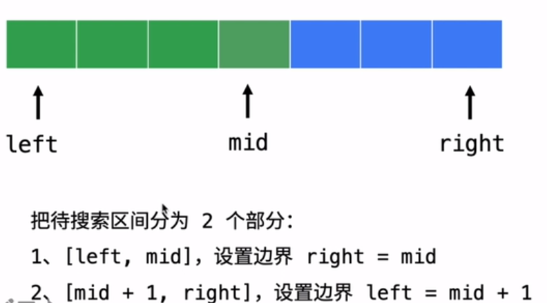
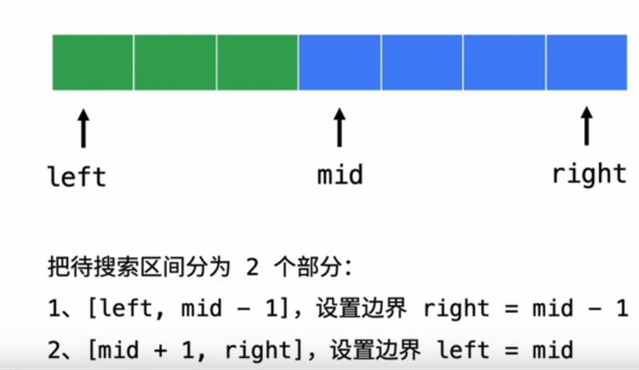

# 二分搜索

## 二分搜索模板

给一个**有序数组**和目标值，找第一次/最后一次/任何一次出现的索引，如果没有出现返回-1

模板四点要素

- 1、初始化：start=0、end=len-1
- 2、循环条件：start <= end
- 3、比较中点和目标值：A[mid] ==、 <、> target
- 4、判断最后两个元素是否符合：A[start]、A[end] ? target

时间复杂度 O(logn)，使用场景一般是有序数组的查找

典型示例

[binary-search](https://leetcode-cn.com/problems/binary-search/)

> 给定一个  n  个元素有序的（升序）整型数组  nums 和一个目标值  target  ，写一个函数搜索  nums  中的 target，如果目标值存在返回下标，否则返回 -1。

```java
// 二分搜索最常用模板
class Solution {
  public int search(int[] nums, int target) {
        //1 初始化
        int mid, left = 0, right = nums.length - 1;
        //2 循环条件：确保left和right之间有一个元素 循环终止条件区间【left,right】
        while (left + 1 < right) {
            mid = left + (right - left) / 2;
            //3 比较中点和目标值
            if (nums[mid] == target) {
                return mid;
            } else if (nums[mid] < target) {
                left = mid + 1;
            } else {
                right = mid - 1;
            }
        }
        //4 最后剩下两个元素，手动判断【left,right】
        if (nums[left] == target) {
            return left;
        }
        if (nums[right] == target) {
            return right;
        }
        return -1;
    }
}
```

大部分二分查找类的题目都可以用这个模板，然后做一点特殊逻辑即可

另外二分查找还有一些其他模板如下图，大部分场景模板#3 都能解决问题，而且还能找第一次/最后一次出现的位置，应用更加广泛


所以用模板#3 就对了，详细的对比可以这边文章介绍：[二分搜索模板](https://leetcode-cn.com/explore/learn/card/binary-search/212/template-analysis/847/)

如果是最简单的二分搜索，不需要找第一个、最后一个位置、或者是没有重复元素，可以使用模板#1，代码更简洁

```java
// 二分查找简单模板：无重复元素搜索时，更方便
class Solution {
    public int search(int[] nums, int target) {
		//1 初始化
        int mid, left = 0, right = nums.length - 1;
		//2 循环条件：确保left和right之间满足区间限制
        while (left <= right) {
			// 为了防止 left + right 整形溢出，写成如下形式
            mid = left + (right - left) / 2;
            if (nums[mid] == target) {
                return mid;
            } else if (nums[mid] < target) {
                left = mid + 1;
            } else {
                right = mid - 1;
            }
        }
        return -1;
    }
}
```
## [补充思路2 在循环体内部排除元素（在解决复杂问题时非常有用）--利用减治思想去除mid](https://www.yuque.com/liweiwei1419/algo/feiopy)
### 思路2的两种模板

* 思路：把待搜索区间分为2部分，一部分一定不存在目标元素，另一部分可能存在目标元素
* 要点（两个模板）：
  * 退出循环的时候一定有 `left == right` 成立，**这一点在定位元素下标的时候极其有用**；
  * 先考虑 `nums[mid]` 在满足什么条件下不是目标元素，确定下一轮搜索的区间。它的反面（也就是 `else` 语句的部分），就不用去考虑对应的区间是什么，直接从上一个分支的反面区间得到
  * 中点防止溢出的写法 `int mid = left + (right - left) / 2;`
  * 中点什么情况+1，只要看到下面 `left = mid`，因为赋值语句mid=left + (right - left) / 2,-->可能出现mid=left 这样形成死循环
  * 退出循环以后，根据情况看是否需要对下标为 `left` 或者 `right` 的元素进行单独判断，这一步叫「**后处理**」。在有些问题中，排除掉所有不符合要求的元素以后，剩下的那 1 个元素就一定是目标元素。如果根据问题的场景，目标元素一定在搜索区间里，那么退出循环以后，可以直接返回 `left`（或者 `right`）。

* **1）mid从右侧区间去除**



```java
public int search(int[] nums, int left, int right, int target) {
    // 在区间 [left, right] 里查找目标元素
    while (left < right) {
        // 选择中间数时下取整
        int mid = left + (right - left) / 2;
        //检查mid能从搜索区间中排除么？右侧区间排除
        if (check(mid)) {
            // 下一轮搜索区间是 [mid + 1, right]
            left = mid + 1;
        } else {
            // 下一轮搜索区间是 [left, mid]
            right = mid;
        }
    }
    // 退出循环的时候，程序只剩下一个元素没有看到，视情况，是否需要单独判断 left（或者 right）这个下标的元素是否符合题意
}
```

* **2）mid从左侧区间去除**



```java
public int search(int[] nums, int left, int right, int target) {
    // 在区间 [left, right] 里查找目标元素
    while (left < right) {
        // 选择中间数时上取整
        int mid = left + (right - left + 1) / 2;
        //检查mid能从搜索区间中排除么？左侧区间排除
        if (check(mid)) {
            // 下一轮搜索区间是 [left, mid - 1]
            right = mid - 1;
        } else {
            // 下一轮搜索区间是 [mid, right]
            left = mid;
        }
    }
    // 退出循环的时候，程序只剩下一个元素没有看到，视情况，是否需要单独判断 left（或者 right）这个下标的元素是否符合题意
}
```
### 思路2 练习

#### [69. x 的平方根](https://leetcode-cn.com/problems/sqrtx/)

```java
  public int mySqrt(int x) {
        // 注意：针对特殊测试用例，例如 2147395599
        // 要把搜索的范围设置成长整型
        // 为了照顾到 0 把左边界设置为 0
        long left = 0;
        // # 为了照顾到 1 把右边界设置为 x // 2 + 1
        long right = x / 2 + 1;
        while (left < right) {
            // 注意：这里一定取右中位数，如果取左中位数，代码会进入死循环
            // long mid = left + (right - left + 1) / 2;
            long mid = (left + right + 1) >>> 1;
            long square = mid * mid;
            if (square > x) {
                right = mid - 1;
            } else {
                left = mid;
            }
        }
        // 因为一定存在，因此无需后处理
        return (int) left;
    }
```


## 常见题目

### [find-first-and-last-position-of-element-in-sorted-array](https://leetcode-cn.com/problems/find-first-and-last-position-of-element-in-sorted-array/)

> 给定一个包含 n 个整数的排序数组，找出给定目标值 target 的起始和结束位置。
> 如果目标值不在数组中，则返回`[-1, -1]`

思路：用二分查找，找到第一次出现target的位置，然后往下遍历找到第二次出现target的位置

```java
class Solution {
   //采用简单模板
    public int[] searchRange(int[] nums, int target) {
        //初始化返回的解
        int[] ans = new int[]{-1, -1};
        if (nums.length == 0 || nums[0] > target) {
            return ans;
        }
        
        // 用二分查找，找到第一次出现target的位置
        //1 初始化
        int left = 0, right = nums.length - 1;
        //2 循环条件
        while (left <= right) {
            int mid = left + ((right - left) / 2);
            //判断target
            if (nums[mid] == target) {
                //相等的时候不直接返回判断是否为最右边的 否则在【left,mid-1】上搜索
                if (mid == 0 || (nums[mid] == target && nums[mid - 1] < target)) {
                    ans[0] = mid;
                    break;
                }else {
                    right = mid - 1;
                }
            }else if (nums[mid] < target) {
                // 应该继续向右边找，即 [mid + 1, right] 区间里找
                left = mid + 1;
            } else {
                // 此时 nums[mid] > target，应该继续向左边找，即 [left, mid - 1] 区间里找
                right = mid - 1;
            }
        }

        //判断第一个位置找到没有，找到则往下遍历
        if (ans[0] != -1 && nums[ans[0]] == target) {
            if (ans[0] == nums.length - 1) {
                ans[1] = ans[0];
            }
            else {
                // 往下遍历找到第二次出现target 的位置
                for (int i = ans[0] + 1; i < nums.length; ++i) {
                    if (nums[i] != target) {
                        ans[1] = i - 1;
                        break;
                    }
                    if (i == nums.length - 1 && nums[i] == target) {
                        ans[1] = i;
                    }
                }
            }
        }
        return ans;
    }
}
```

### [search-insert-position](https://leetcode-cn.com/problems/search-insert-position/)

> 给定一个排序数组和一个目标值，在数组中找到目标值，并返回其索引。如果目标值不存在于数组中，返回它将会被按顺序插入的位置。

```java
class Solution {
    //使用复杂模板
    public int searchInsert(int[] nums, int target) {
        
        //1 初始化
        int left=0,right=nums.length-1;
        int mid=0;
        //2 循环条件 【left,x,right】 终止【left,right】
        while(left+1<right){
            mid=left+(right-left)/2;
            //3 判断target
            if(nums[mid]==target){
                return mid;
            }else if(target<nums[mid]){
                right=mid-1;
            }else{
                left=mid+1;
            }
        }
        
        //寻找成功
        if(nums[left]==target){
            return left;
        }else if(nums[right]==target){
            return right;
         //大小left,right之间   
        }else if(target>nums[left]&&target<nums[right]){
            return left+1;
         //比right大  
        }else if(target>nums[right]){
            return right+1;
        }else{
            //比left小
            return left;
        }
    }
}
```

### [search-a-2d-matrix](https://leetcode-cn.com/problems/search-a-2d-matrix/)

> 编写一个高效的算法来判断  m x n  矩阵中，是否存在一个目标值。该矩阵具有如下特性：
>
> - 每行中的整数从左到右按升序排列。
> - 每行的第一个整数大于前一行的最后一个整数。

```java
class Solution {
    //使用简单模板
   //两次二分查找
    public boolean  searchMatrix(int[][] matrix, int target) {
        if(matrix.length==0||matrix[0].length==0)
            return false;
        //先确定在第几行
        //1 初始化
        int mid, left = 0, right =matrix.length - 1;
        //2 循环条件：确保left和right之间满足区间限制
        while (left <= right) {
            mid = left + (right - left) / 2;
            if (matrix[mid][0] == target) {
                return true;
            } else if (matrix[mid][0]  < target) {
                left = mid + 1;
            } else {
                right = mid - 1;
            }
        }

        int find=right;
        //right<left
        if (right<0)
            find=left;

        //再确定在第几列
        //先确定在第几行
        //1 初始化
        int mid1, left1 = 0, right1 =matrix[0].length - 1;
        //2 循环条件：确保left和right之间满足区间限制
        while (left1 <= right1) {
            mid1 = left1 + (right1 - left1) / 2;
            if (matrix[find][mid1] == target) {
                return true;
            } else if (matrix[find][mid1] < target) {
                left1 = mid1 + 1;
            } else {
                right1 = mid1 - 1;
            }
        }

        return false;
    }
}
```

### [first-bad-version](https://leetcode-cn.com/problems/first-bad-version/)

> 假设你有 n 个版本 [1, 2, ..., n]，你想找出导致之后所有版本出错的第一个错误的版本。
> 你可以通过调用  bool isBadVersion(version)  接口来判断版本号 version 是否在单元测试中出错。实现一个函数来查找第一个错误的版本。你应该尽量减少对调用 API 的次数。

```java
/* The isBadVersion API is defined in the parent class VersionControl.
      boolean isBadVersion(int version); */

public class Solution extends VersionControl {
    public int firstBadVersion(int n) {
        //使用简单模板
        //1 初始化
        int mid, left = 0, right = n;
        //2 循环条件：确保left和right之间满足区间限制
        while (left <= right) {
            mid = left + (right - left) / 2;
            if (isBadVersion(mid) == false&&isBadVersion(mid+1) == true) {
                return mid+1;
            } else if (isBadVersion(mid)==false&&isBadVersion(mid+1) == false) {
                left = mid + 1;
            } else {
                right = mid - 1;
            }
        }
        return -1;
    }
}
```

### [find-minimum-in-rotated-sorted-array](https://leetcode-cn.com/problems/find-minimum-in-rotated-sorted-array/)

> 假设按照升序排序的数组在预先未知的某个点上进行了旋转( 例如，数组  [0,1,2,4,5,6,7] 可能变为  [4,5,6,7,0,1,2] )。
> 请找出其中最小的元素。

经我测试这道题不用二分查找反而更快，找到第一个比前一个值小的数就是最小值
```java
class Solution {
    public int findMin(int[] nums) {
        //nums长度为1
        if (nums.length==1)
            return nums[0];
        //比较前n-2个数
        for (int i = 0; i < nums.length-1; i++) {
            if (nums[i]>nums[i+1]){
                return nums[i+1];
            }
        }
        //比较最后两个数
        if (nums[nums.length-2]<nums[nums.length-1]){
            //递增数列
            return nums[0];
        }else{
            //最后一个数最小
            return nums[nums.length-1];
        }
    }
}
```

### [find-minimum-in-rotated-sorted-array-ii](https://leetcode-cn.com/problems/find-minimum-in-rotated-sorted-array-ii/)

> 假设按照升序排序的数组在预先未知的某个点上进行了旋转
> ( 例如，数组  [0,1,2,4,5,6,7] 可能变为  [4,5,6,7,0,1,2] )。
> 请找出其中最小的元素。(包含重复元素)

```java
class Solution {
    public int findMin(int[] nums) {
        int right = nums.length - 1, left = 0;
        if(right == 0) {
            return nums[0];
        }
        // 把nums[right]当做target做二分
        while (left < right) {
            int mid = left + ((right - left) >> 1);
            if (nums[mid] < nums[right]) {
                right = mid;
            } else if (nums[mid] > nums[right]) { //最小值一定在[mid+1, right]索引中
                left = mid + 1;
            } else { // 相等表示重复，往左边移一位
                right--;
            }
        }
        return nums[left];
    }
}
```

### [search-in-rotated-sorted-array](https://leetcode-cn.com/problems/search-in-rotated-sorted-array/)

> 假设按照升序排序的数组在预先未知的某个点上进行了旋转。
> ( 例如，数组  [0,1,2,4,5,6,7]  可能变为  [4,5,6,7,0,1,2] )。
> 搜索一个给定的目标值，如果数组中存在这个目标值，则返回它的索引，否则返回  -1 。
> 你可以假设数组中不存在重复的元素。

```java
class Solution {
    //使用简单模板
    public int search(int[] nums, int target) {
        int left = 0, len = nums.length, right = len - 1;
        if (len == 0) {
            return -1;
        }
        if (len == 1) {
            return nums[0] == target ? 0 : -1;
        }
        while (left <= right) {
            int mid = left + ((right - left) >> 1);
            if (nums[mid] == target) {
                return mid;
            }
            // 左半段
            if (nums[0] <= nums[mid]) {
                // 左半段左部
                if (nums[0] <= target && target < nums[mid]) {
                    right = mid - 1;
                } else {
                    left = mid + 1;
                }
            } else { // 右半段
                // 右半段右部
                if (target > nums[mid] && target <= nums[len - 1]) {
                    left = mid + 1;
                } else {
                    right = mid - 1;
                }
            }
        }
        return -1;
    }
}
```

注意点

> 面试时，可以直接画图进行辅助说明，空讲很容易让大家都比较蒙圈

### [search-in-rotated-sorted-array-ii](https://leetcode-cn.com/problems/search-in-rotated-sorted-array-ii/)

> 假设按照升序排序的数组在预先未知的某个点上进行了旋转。
> ( 例如，数组  [0,0,1,2,2,5,6]  可能变为  [2,5,6,0,0,1,2] )。
> 编写一个函数来判断给定的目标值是否存在于数组中。若存在返回  true，否则返回  false。(包含重复元素)

```java
class Solution {
    public boolean search(int[] nums, int target) {
        int left = 0, len = nums.length, right = len - 1;
        if (len == 0) {
            return false;
        }
        if (len == 1) {
            return nums[0] == target ? true :false;
        }
        while (left <= right) {
            int mid = left + ((right - left) >> 1);
            if (nums[mid] == target) {
                return true;
            }
            //变动，去掉干扰重复项
            if (nums[left] == nums[mid]) {
                left++;
                continue;
            }
            // 左半段
            //nums[0]-->nums[left]
            if (nums[left] <= nums[mid]) {
                // 左半段左部
                //nums[0]-->nums[left]
                if (nums[left] <= target && target < nums[mid]) {
                    right = mid - 1;
                } else {
                    left = mid + 1;
                }
            } else { // 右半段
                // 右半段右部
                if (target > nums[mid] && target <= nums[right]) {
                    left = mid + 1;
                } else {
                    right = mid - 1;
                }
            }
        }
        return false;
    }
}
```

## 总结

二分搜索核心四点要素（必背&理解）

- 1、初始化：start=0、end=len-1
- 2、循环退出条件：start + 1 < end
- 3、比较中点和目标值：A[mid] ==、 <、> target
- 4、判断最后两个元素是否符合：A[start]、A[end] ? target

## 练习题

- [ ] [search-for-range](https://www.lintcode.com/problem/search-for-a-range/description)
- [ ] [search-insert-position](https://leetcode-cn.com/problems/search-insert-position/)
- [ ] [search-a-2d-matrix](https://leetcode-cn.com/problems/search-a-2d-matrix/)
- [ ] [first-bad-version](https://leetcode-cn.com/problems/first-bad-version/)
- [ ] [find-minimum-in-rotated-sorted-array](https://leetcode-cn.com/problems/find-minimum-in-rotated-sorted-array/)
- [ ] [find-minimum-in-rotated-sorted-array-ii](https://leetcode-cn.com/problems/find-minimum-in-rotated-sorted-array-ii/)
- [ ] [search-in-rotated-sorted-array](https://leetcode-cn.com/problems/search-in-rotated-sorted-array/)
- [ ] [search-in-rotated-sorted-array-ii](https://leetcode-cn.com/problems/search-in-rotated-sorted-array-ii/)
