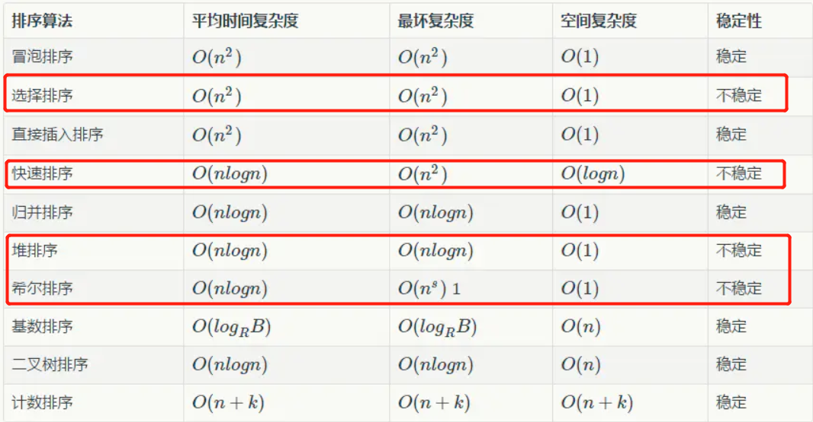

# 排序

## 常考排序

### 快速排序

```
* 普通快速排序算法基本思路
* 1.从数组arr中随机挑选一个元素,定为基准点arr[p]
* 2.对数组arr进行从新排序,使得arr[l...p-1] < arr[p] ; arr[p+1...r] > arr[p],
*   这个操作过程称为分区(partition)
* 3.使用递归的方式重复步骤1和2分别处理左侧数组arr[l...p-1] 和 右侧数组arr[p+1...r],
*   直到无法分区,此时数组排序完成.
*
*   arr[l+1...j] < v < arr[j+1...i)
*   时间复杂度分析:
*   快速排序每次将待排序数组分为两个部分，在理想状况下，
*   每一次都将待排序数组划分成等长两个部分，则需要logN次划分
*   即存在 logN 层,而每层需要处理的元素个数都是一样的即N,此时时间
*   复杂度为 N*logN
*   而在最坏情况下，即数组已经有序或大致有序的情况下，每次划分
*   只能减少一个元素，快速排序将不幸退化为冒泡排序，因为每次分
*   区只可能交互一个元素,时间复杂度为O(N²)
*   所以快速排序时间复杂度下界为O(N*logN)，最坏情况为O(N²)。
*   在实际应用中，快速排序的平均时间复杂度为O(nlogn)。
```

```java
public class Solution {
    public static void sort(int[] arr){
        // 思路：把一个数组分为左右两段，左段小于右段，类似分治法没有合并过程
        quickSort(arr,0,arr.length-1);
    }

    /**
     * 使用递归实现快速排序
     * @param arr
     * @param start
     * @param end
     */
    public static void quickSort(int[] arr,int start,int end){
        //递归终止条件
        if (start >= end){
            return;
        }

        //获取分区的基准点的数组下标pivot,pivot左边的比arr[pivot]小，右边的比arr[pivot]大
        int pivot = partition(arr,start,end);
        //使用递归的方式继续进行分区
        quickSort(arr,start,pivot-1); //处理左侧数组
        quickSort(arr,pivot+1,end); //处理右侧数组

    }

    /**
     * 进行分区操作
     * 对arr[start...end]部分进行partition操作
     * 返回pivot, 使得arr[start...pivot-1] < arr[pivot] ; arr[pivot]<arr[pivot+1...end]
     */
    private static int partition(int[] arr,int start ,int end){
        //随机在arr[start...end]的范围中, 选择一个数值作为标定点pivot
        //之所以要随机选择,是为了防止在出现大规模近乎有序的数据时若只取左边的值可能会
        //造成快速排序算法退化到O(N²)级别,与二叉树退化成链表是同样的道理.
        //产生的随机数0=<random<r+1
        //最右侧存放pivot
        swap(arr,end,(int)(Math.random()*(end-start+1))+start);
        //确定分组元素，end存放的是基准
        int target = arr[end];
        //进行分区操作,使用得 arr[start...j]< target(j++) < arr(j...i) i是当前正在判断的元素
        int j = start;
        //注意i需要从start起,end-1结束不包括end，end存放的是基准元素
        for (int i = start; i < end ; i++) {
            //当前元素比基准点元素小,移动到target的左侧.
            //当前元素比基准点元素大,无需移动.
            if(arr[i]< target){
                swap(arr,j,i);
                j++;//j往后移动一位
            }
        }

        //最后将基准点移动到j的位置,形成arr[l...j-1] < arr[j] < arr[j+1...r]
        swap(arr,j,end);
        //返回基准点下标
        return j;
    }


    public static void swap(int[] arr, int i, int j) {
        int t = arr[i];
        arr[i] = arr[j];
        arr[j] = t;
    }
}
```

### 归并排序

```
归并排序算法,采用的是分而治之的策略.其核心思想是先把要排序的数组元素不断得进行一分为二,
* 直到每个分组只有一个元素时,由于该分组只有一个元素就本身就是有序的数组,然后再将有序的数组
* 两两合并为新的有序数组,合并完成后如果还有分组就重复前面的操作将有序数组再次合并为新的有
* 序数组,直到合并为一个数组为止.最终数组就是有序数组.如下演示:
*  8 5 1 2 7 6 3 4 其中l=0 r=7 , mid=(l+r)/2 =3
* 根据下标3分为两组: [8 5 1 2] [7 6 3 4]
*
* 注意:先处理左边分组(继续分组操作直到分组的元素个数为1)
* [8 5 1 2] ==> L=0 R=3 mid=(l+r)/2=1
* [8 5] [1 2]
* [8 5] ==> L=0 R=1 mid=0;
* [8] [5] ==> L=0 R=0 L>=R 分组结束
* 对有序数组[8] [5]进行归并[5 8]
* [1 2] ==> L=2 R=3 mid=2
* [1] [2] ==> L=2 R=2 L>=R 分组结束
* 对有序数组[1] [2]进行归并[1 2]
* 再对有序数组[5 8] [1 2]进行合并[1 2 5 8]
* 左边最终处理结果:[1 2 5 8]
*
* 再处理右边分组
* [7 6 3 4] ==> L=4 R=7 mid=5
* [7 6] [3 4]
* [7 6] ==> L=4 R=5 mid=4
* [7] [6] ==> L=4 R=4 L>=R分组结束
* 合并有序数组[7] [6] => [6 7]
* 同理: [3] [4] => [3 4]
* 合并有序数组[6 7] [3 4] ==> [3 4 6 7]
* 右边处理完成
*
* 最终合并有序数组[1 2 5 8] 和 [3 4 6 7]
* [1 2 3 4 5 6 7 8]
*
*
* 归并排序时间复杂度分析:
* 对于数组进行分组直到数组元素个数为1,采用的是类似与二叉树查找的操作,因此假设数组元素个数为N,
* 那么N个元素分组后最多有 ㏒N 层.由于每层分组后最终都需要对数组执行归并操作,而每层处理的归并
* 操作(该操作就是让数组中元素交换位置)总元素是是固定的为N.
* 因此归并排序的时间复杂度为 N * ㏒N
*
*             [8 5 1 2 7 6 3 4]
*  1层       [8 5 1 2] [7 6 3 4]
*  2层      [8 5] [1 2] [7 6] [3 4]
*  3层   [8] [5] [1] [2] [7] [6] [3] [4]
*                  执行归并操作
*         [5 8]  [1 2]   [6 7]   [3 4]    每次归并操作元素个数为N
*          [1 2 5 8]       [3 4 6 7]
*              [1 2 3 4 5 6 7 8]
*
*
*  归并排序算法和快速排序算法是java.util.Arrays中使用的排序算。
*  对于一般的基本数据类型，Arrays.sort函数使用双轴快速排序算法，
*  而对于对象类型使用归并排序（准确的说使用的是TimSort排序算法，
*  它是归并排序的优化版本）。这样做的原因有两点
*  第一个原因，归并排序是稳定的而快速排序不是稳定的。
*  第二个原因，对于基本数据类型，排序的稳定性意义不大，
*  但对于复合数据类型（比如对象）排序的稳定性就能帮助我们保持排序结果的某些性质。
```
#### 递归版本 自顶向下
```java
public class Solution {
    /**
     * 排序数组
     * @param array
     * @return
     */
    public int[] mergeSortRoot(int[] array) {
        //排序的数组，左边界，右边界
        mergeSort(array, 0 , array.length - 1);
        return array;
    }

    /**
     *
     * @param array 排序的数组
     * @param l 左边界
     * @param r 右边界
     */
    private void mergeSort(int[] array, int l, int r) {
        //递归结束条件(分组后数组只有一个元素时不再分组)
        if(l>=r){
            return;
        }

        int mid = (l + r) / 2;
        //分治：递归分成左右两组
        mergeSort(array, l, mid);
        mergeSort(array, mid + 1, r);
        //合并：左右两边都分组完成（即分组后数组元素只有一个）后开始合并
        merge(array, l, mid, r);

    }


    private void merge(int[] array, int l, int mid, int r) {
        //i指向合并array的左部分，j指向合并array的右部分
        //k指向合并的临时数组
        int i = l, j = mid + 1, k = l;
        //合并的临时数组
        int[] tmp = new int[array.length];
        //合并到temp中
        while (i <= mid && j <= r) {
            if (array[i] > array[j]) {
                tmp[k++] = array[j++];
            } else {
                tmp[k++] = array[i++];
            }
        }
        //合并左部分剩余
        while (i <= mid) {
            tmp[k++] = array[i++];
        }
        //合并右部分剩余
        while (j <= r) {
            tmp[k++] = array[j++];
        }
        //将合并好的temp赋值到array
        for (i = l; i <= r; i++) {
            array[i] = tmp[i];
        }
    }
}
```
#### 循环版本 自底向上

```
* 自底向上的归并排序算法的思想就是数组中先一个一个归并成两两有序的数组，
* 两两有序的数组归并成四个四个有序的数组，然后四个四个有序的序列归并八
* 个八个有序的数组，以此类推，直到，归并的长度大于整个数组的长度，此时
* 整个数组有序。需要注意的是数组按照归并长度划分，最后一个子数组可能不
* 满足长度要求，这种情况需要注意。自顶下下的归并排序算法一般用递归
* 来实现，而自底向上可以用循环来实现。
*                                         ∧
*          [1 2 3 4 5 6 7 8]              ‖上    最后合并成一个有序数组
*        [1 2 5 8]  [3 4 6 7]             ‖向    再归并成四四分组
*       [5 8] [1 2] [6 7] [3 4]           ‖底    先按两两分组,然后排序
*   [8] [5] [1] [2] [7] [6] [3] [4]       ‖自    一一分组然后归并
*         [8 5 1 2 7 6 3 4]               ‖      未分组
```

```java
public void sort(int[] array){
    int len = array.length;
    //分组循环排序,sz表示每组分组的个数,第一轮分组数组个数为1,依次2倍增加，每一分组在长度范围内
    //1.1 每轮分组
    for (int sz = 1; sz < len ; sz += sz) {
        
        //1.2 对相邻两个分组进行两两归并
        //由于每次归并的是两个分组个数,所以归并的间隔是 sz + sz = 2 * sz
        //i为归并的起点，起点在长度范围内
        for (int i = 0; i < len ; i += 2*sz) {
            
            //i+sz 代表分组的下标最大值,由于下标从0开始,所以需要i+sz-1
            //用于归并的第二组起始点是i+sz,结束点:i + sz - 1 + sz
            //对array[i....i+sz-1] 和 array[i+sz.....i+sz+sz-1]进行归并
            int l = i;
            int mid = i+sz-1;
            int r = i+sz+sz-1;
            //进行合并操作Math.min(mid,len-1),,Math.min(r,len-1)防止数组越界,存在最后一个分组不符合间隔要求的情况
            merge(array,l,Math.min(mid,len-1),Math.min(r,len-1));
        }
    }
}
//归并函数
private void merge(int[] array, int l, int mid, int r) {
    //i指向合并array的左部分，j指向合并array的右部分
    //k指向合并的临时数组
    int i = l, j = mid + 1, k = l;
    //合并的临时数组
    int[] tmp = new int[array.length];
    //合并到temp中
    while (i <= mid && j <= r) {
        if (array[i] > array[j]) {
            tmp[k++] = array[j++];
        } else {
            tmp[k++] = array[i++];
        }
    }
    //合并左部分剩余
    while (i <= mid) {
        tmp[k++] = array[i++];
    }
    //合并右部分剩余
    while (j <= r) {
        tmp[k++] = array[j++];
    }
    //将合并好的temp赋值到array
    for (i = l; i <= r; i++) {
        array[i] = tmp[i];
    }
```

### 堆排序

用数组表示的完美二叉树 complete binary tree

> 完美二叉树 VS 其他二叉树


[动画展示](https://www.bilibili.com/video/av18980178/)


核心代码

```java
/**
 * Created by zejian on 2017/9/19.
 * https://www.cnblogs.com/chengxiao/p/6129630.html
 * 堆排序是利用堆这种数据结构而设计的一种排序算法，堆排序是一种选择排序，它的最坏，最好，平均时间复杂度均为O(nlogn)
 * 最大堆排序(数组下标从0开始)---->大顶堆输出排序升序序列（降序采用小顶堆）
 * 步骤：
 * 1  构造初始堆，将给定无序序列构造成一个大顶堆
 * 2  将堆顶元素与末尾元素进行交换，使末尾元素最大。然后继续调整堆，再将堆顶元素与末尾元素交换，得到第二大元素。如此反复进行交换、重建、交换。
 */
public class XinMaxHeapSort{

    /**
     * 堆排序,每次取最大的排到数组尾部
     * @param array 注意索引从0开始
     * @return
     */
    public void heapSort(int[] array){
        if(array == null){
            throw new RuntimeException("array can't be null!");
        }

        int len = array.length;
        //1 构造初始堆，将给定无序序列构造成一个大顶堆
        //父子节点的坐标关系 父节点i,左孩子2i+1,右孩子2i+2 子节点i-->父节点【(i-1）/2】
        //先把array构建成最大堆,从第一个非叶子结点开始即【i=(n-1)/2】
        // 开始向下过滤 过滤顺序  子节点从左至右，父节点从下至上
        for(int i=(len-1-1)/2 ; i >= 0 ; i--){
            //进行下过滤
            siftDownSort1(array,i,len);
        }

        //2 将堆顶元素与末尾元素进行交换，使末尾元素最大（固定最后元素）。然后继续调整堆
        //直至所有元素都固定
        while (len > 0){
            swap(array,0,--len);//注意索引从0开始
            siftDownSort1(array,0,len);
        }
    }

    //向下过滤并不是过滤一次，不断往下（因为只要交换了就会产生影响）直到下无可下左孩子都越界
    private void siftDownSort(int[] array,int i,int len){

        //不断往下直到无人可以用
        while ((2*i + 1) < len){
            //左右孩子中跳出最大的代表 left指向
            int left = 2*i + 1;
            if((left + 1) < len && array[left] < array[left+1]){
                left ++;
            }

            //子结点小于父结点i,那么就不用交换
            if(array[i] > array[left]){
                break;
            }
            //i和left换了继续往下过滤
            swap(array,left,i);
            i = left;
            //只要交换了就一直向下过滤
        }
    }
    //递归写法
    private void siftDownSort1(int[] array,int i,int len){

        //不断往下直到无人可以用
        if ((2*i + 1) >= len)
            return;
        //左右孩子中跳出最大的代表 left指向
        int left = 2*i + 1;
        if((left + 1) < len && array[left] < array[left+1]){
            left ++;
        }
        //比较过程
        //父结点i小于子结点,那么就交换
        if(array[i] < array[left]){
            //i和left交换
            swap(array,left,i);
        }
        //left和i交换后,子节点继续往下过滤
        siftDownSort1(array,left,len);

    }

    private void swap(int[] array,int i , int j){
        int temp = array[i];
        array[i] = array[j];
        array[j] = temp;
    }
}
```

## 参考

[十大经典排序](https://www.cnblogs.com/onepixel/p/7674659.html)

[二叉堆](https://labuladong.gitbook.io/algo/shu-ju-jie-gou-xi-lie/er-cha-dui-xiang-jie-shi-xian-you-xian-ji-dui-lie)

## 常考手写排序的要点
- 快速排序(应用递归)：1）递归终止条件 只有一个元素（start>=end） 2）分区partition，返回分区中间坐标 3）左右区间递归快速排序（除去中间坐标）
- 归并排序（自顶向下，应用递归)：1）递归终止条件 只有一个元素 2）左右区间递归归并排序（分治）3）合并merge
- 堆排序（应用核心函数下滤）：1）构造初始堆（从第一个非叶子结点开始下滤）2） 将堆顶元素与末尾元素进行交换（交换完下滤）3) 下滤函数体`siftDownSort(int[] array,int i,int len)`

## 可能考的排序
### [选择排序(了解)](https://www.yuque.com/liweiwei1419/algo/sfqelg)
思路：每一轮选取未排定的部分中最小的那个元素交换到未排定部分的最开头，经过若干个步骤，就能排定整个数组。即：先**选出最小**的，再选出第二小的，以此类推
```java
import java.util.Arrays;

public class Solution {

    public int[] sortArray(int[] nums) {
        int len = nums.length;
        // 循环不变量：[0, i) 有序，且该区间里所有元素就是最终排定的样子
		//从数组前面选出最小的固定
        for (int i = 0; i < len - 1; i++) {
            // 选择区间 [i, len - 1] 里最小的元素的索引，交换到下标 i
            int minIndex = i;
            for (int j = i + 1; j < len; j++) {
                if (nums[j] < nums[minIndex]) {
                    minIndex = j;
                }
            }
            swap(nums, i, minIndex);
        }
        return nums;
    }

    private void swap(int[] nums, int index1, int index2) {
        int temp = nums[index1];
        nums[index1] = nums[index2];
        nums[index2] = temp;
    }

    public static void main(String[] args) {
        int[] nums = {5, 2, 3, 1};
        Solution solution = new Solution();
        int[] res = solution.sortArray(nums);
        System.out.println(Arrays.toString(res));
    }
}
```
- 选择排序的特点:交换次数最少
- 选择排序的优化:选出未排定部分的最⼤值：O(N)--以空间换时间->O(logN)
堆排序（Heap Sort）

### [冒泡排序(了解)](https://www.yuque.com/liweiwei1419/algo/ilg11p)
冒泡排序的基本思想是：反复交换相邻的，但没有按照次序排列的元素，每一轮将一个「未排定部分」**最大的元素**「冒泡」到「未排定部分」的末尾，直至整个数组有序。
```java
public class Solution {

    // 冒泡排序（基础版）：超时

    public int[] sortArray(int[] nums) {
        int len = nums.length;
		//从后冒泡固定最大的
        for (int i = len - 1; i >= 0; i--) {
            // 只要发生一次交换，就必须进行下一轮比较，
            for (int j = 0; j < i; j++) {
                if (nums[j] > nums[j + 1]) {
                    swap(nums, j, j + 1);
                }
            }
        }
        return nums;
    }

    private void swap(int[] nums, int index1, int index2) {
        int temp = nums[index1];
        nums[index1] = nums[index2];
        nums[index2] = temp;
    }
}
```
### [插入排序(熟悉)](https://www.yuque.com/liweiwei1419/algo/pbpdec)
思路：每次将一个数字插入一个有序的数组（从下标1开始插入）里，成为一个长度更长的有序数组。有限次操作以后，数组整体有序。
```java
public class Solution {

    public int[] sortArray(int[] nums) {
        int len = nums.length;
        // 循环不变量：将 nums[i] 插入到区间 [0, i) 使之成为有序数组
        for (int i = 1; i < len; i++) {
            // 先暂存这个元素，然后之前元素逐个后移，留出空位
            int temp = nums[i];
            int j = i;
			//nums[j] 指示着为空将要移入的位置
            // 注意边界 j > 0
            while (j > 0 && nums[j - 1] > temp) {
                nums[j] = nums[j - 1];
                j--;
            }
            nums[j] = temp;
        }
        return nums;
    }
}
```
特点：
- 「插入排序」可以提前终止内层循环（体现在 nums[j - 1] > temp 不满足时）；
在数组「几乎有序」的前提下，「插入排序」的时间复杂度可以达到O(N)
## 排序总结



[排序算法稳定性分析](https://blog.csdn.net/dreamer2020/article/details/8740244)

## [比较器的应用](https://www.cnblogs.com/skywang12345/p/3324788.html)
如果比较结果为1(大于0)进行交换，其他不进行交换。

### （一）数组排序 Arrays.sort(T[] a, Comparator<? super T> c)  
根据指定比较器产生的顺序对指定对象数组进行排序。

[56. 合并区间](https://leetcode-cn.com/problems/merge-intervals/)
```java
class Solution {
    public int[][] merge(int[][] intervals) {
        //按数组下标升序排序intervals
        Arrays.sort(intervals, new Comparator<int[]>() {
            @Override
            public int compare(int[] o1, int[] o2) {
                //o1[0]<o2[0] 不不交换 升序
                return o1[0]-o2[0];
            }
        });


        //结果存放在ArrayList<int[]>
        LinkedList<int[]> result= new LinkedList<>();
        result.addLast(intervals[0]);

        //遍历intervals依次两两比较（result结果与intervals比较）
        for (int i = 1; i < intervals.length; i++) {
            int[] compare = result.peekLast();
            //情况1：互不相交
            if (compare[1]<intervals[i][0]){
                result.addLast(intervals[i]);
            }else{
                //情况2：一种相交
                result.removeLast();
                intervals[i][0]=compare[0];
                intervals[i][1]=Math.max(intervals[i][1],compare[1]);
                result.addLast(intervals[i]);
            }
        }
        

        //List-->Array
        int[][] resultarray = result.toArray(new int[result.size()][2]);
        return  resultarray;
    }
}
```
### （二）集合排序 Collections.sort(List<T> list, Comparator<? super T> c) 
根据指定比较器产生的顺序对指定列表进行排序。

[179. 最大数](https://leetcode-cn.com/problems/largest-number/)
```java
class Solution {
    public String largestNumber(int[] nums) {

        ArrayList<String> all =new ArrayList<>();
        for (int i = 0; i < nums.length; i++) {
            StringBuffer world=new StringBuffer();
            if (nums[i]==0){
                all.add("0");
            }else{
                while (nums[i]!=0){
                    int k=nums[i]%10;
                    nums[i]=nums[i]/10;
                    //k--->char
                    char temp=(char) ('0'+k);
                    world.append(temp);
                }
                world.reverse();
                all.add(world.toString());
            }

        }
        //对all进行降序排序
        Collections.sort(all,new Comparator<String>() {
            @Override
            public int compare(String s1, String s2) {
                String sum1=s1+s2;
                String sum2=s2+s1;
                for (int i = 0; i <sum1.length() ; i++) {
                    if (sum1.charAt(i)<sum2.charAt(i)){
                        //交换顺序
                        return 1;
                    }else if(sum1.charAt(i)>sum2.charAt(i)){
                        return -1;
                    }
                }
                return 0;
            }
        });
        String result ="";
        for (int i = 0; i < all.size(); i++) {
            result+=all.get(i);
        }
        int index=-1;
        for (int i = 0; i <result.length()-1 ; i++) {
            if (result.charAt(i)=='0'){
                index=i;
            }else{
                break;
            } 
        }
        String realresult=result;
        if (index!=-1){
            realresult= result.substring(index + 1);
        }
        return realresult;

    }
}
```
## 常考排序的题
### 快排的题
[912. 排序数组](https://leetcode-cn.com/problems/sort-an-array/)

[215. 数组中的第K个最大元素](https://leetcode-cn.com/problems/kth-largest-element-in-an-array/)

发现每次经过「划分」操作后，我们一定可以确定一个元素的最终位置，所以是优化版的快排，终止条件改变，只要确定了第K个最大元素就返回。

```java
public int findKthLargest(int[] nums, int k) {
        int result = quickSortSelect(nums, 0, nums.length - 1, k - 1);
        return result;
    }

    private int quickSortSelect(int[] nums, int start, int end,int index) {


        int pivot=partition(nums,start,end);
        //递归终止条件确定的pivot正是pivot==所要查找的第index个元素
        if (index==pivot) {
            return nums[index];
        }else if (index<pivot){
            //所要查找的第index个元素<pivot
            return quickSortSelect(nums, start, pivot - 1, index);
        }else{
            //所要查找的第index个元素>pivot
            return quickSortSelect(nums, pivot + 1, end, index);
        }
    }

    private int partition(int[] nums, int start, int end) {
        int pivot=(int)(Math.random()*(end-start+1))+start;
        int target=nums[pivot];
        swap(nums,pivot,end);

        //i指向正在遍历的，j指向大于target
        int j=start;
        //将数组降序排列
        for (int i = start; i < end; i++) {
            if (nums[i]>target){
                swap(nums,i,j);
                j++;
            }
        }
        swap(nums,j,end);
        return j;
    }

    private void swap(int[] nums, int a, int b) {
        int t=nums[a];
        nums[a]=nums[b];
        nums[b]=t;
    }
```

### 归并的题

[148. 排序链表](https://leetcode-cn.com/problems/sort-list/)
```java
  public ListNode sortList(ListNode head) {
        int length = getLength(head);
        ListNode dummy = new ListNode(-1);
        dummy.next = head;

        for (int step = 1; step < length; step *= 2) { //依次将链表分成1块，2块，4块...
            //每次变换步长，pre指针和cur指针都初始化在链表头
            ListNode pre = dummy;
            ListNode cur = dummy.next;
            while (cur != null) {
                ListNode h1 = cur; //第一部分头 （第二次循环之后，cur为剩余部分头，不断往后把链表按照步长step分成一块一块...）
                ListNode h2 = split(h1, step);  //第二部分头
                cur = split(h2, step); //剩余部分的头
                ListNode temp = merge(h1, h2); //将一二部分排序合并
                pre.next = temp; //将前面的部分与排序好的部分连接
                while (pre.next != null) {
                    pre = pre.next; //把pre指针移动到排序好的部分的末尾
                }
            }
        }
        return dummy.next;
    }

    public int getLength(ListNode head) {
        //获取链表长度
        int count = 0;
        while (head != null) {
            count++;
            head = head.next;
        }
        return count;
    }

    //返回后半部分这个链表头
    public ListNode split(ListNode head, int step) {
        //断链操作 返回第二部分链表头
        if (head == null) return null;
        ListNode cur = head;
        //注意这里cur.next!=null 有可能出现后半段还没到规定步长但是走完的情况
        for (int i = 1; i < step && cur.next != null; i++) {
            cur = cur.next;
        }
        ListNode right = cur.next;
        cur.next = null; ////切断前半段连接
        return right; //返回后半段链表头
    }

    public ListNode merge(ListNode h1, ListNode h2) {
        //合并两个有序链表
        ListNode head = new ListNode(-1);
        ListNode p = head;
        while (h1 != null && h2 != null) {
            if (h1.val < h2.val) {
                p.next = h1;
                h1 = h1.next;
            } else {
                p.next = h2;
                h2 = h2.next;
            }
            p = p.next;
        }
        if (h1 != null) p.next = h1;
        if (h2 != null) p.next = h2;

        return head.next;
    }
```

### 推排序的题

[215. 数组中的第K个最大元素](https://leetcode-cn.com/problems/kth-largest-element-in-an-array/)
```java

 public int findKthLargest(int[] nums, int k) {
        //先构建最大堆
        int len =nums.length;
        for (int i = (len-1-1)/2; i>=0 ; i--) {
            down(nums,i,len);
        }
        //输出最大元素
        for (int i = 1; i<=k; i++) {
            if (i==k){
                return nums[0];
            }
            swap(nums,0,len-i);
            down(nums,0,len-i);
        }
        return nums[0];
    }


    public void down(int[] nums,int i,int len){
        int left=2*i+1;
        if (left>=len)
            return;
        if (left+1<len&&nums[left]<nums[left+1]){
            left++;
        }

        if (nums[i]<nums[left]){
            swap(nums,i,left);
        }

        down(nums,left,len);

    }

    private void swap(int[] nums, int i, int j) {
        int temp=nums[i];
        nums[i]=nums[j];
        nums[j]=temp;
    }
```

